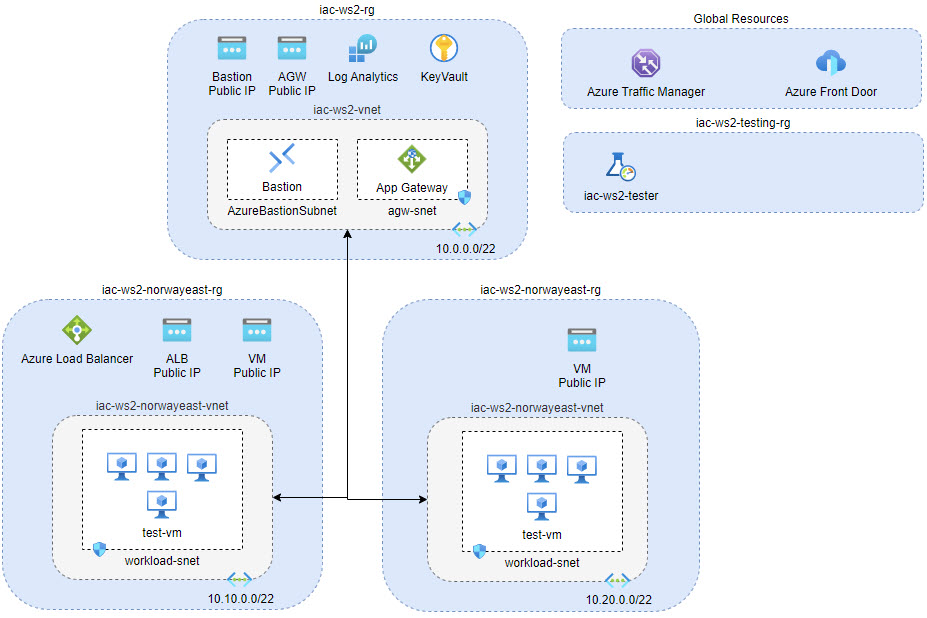

# lab-01 - provision workshop support resources

## Goals

To save time during the workshop, we will pre-provision some of the resources that we will need during the workshop in advance. This will allow us to focus on the workshop content and not spend time on provisioning resources. 
At the same time, some of the resources you will provisioned manually as part of labs. In that case, we will be using portal, because for (relatively) complex resources, it's easier to understand how different components relate to each other when they visually represented on the portal.

Here is how our lab infrastructure will look like:



> Note. All resource names follow naming convention described in [conventions](../../conventions.md) document.

| Resource name | Description |
| --- | --- |
| iac-ws2-rg | resource group for "shared" resources like Bastion, Application Gateway, Azure KeyVault  etc... |
| iac-ws2-norwayeast-rg | resource group for resources located at `norwayeast` region |
| iac-ws2-eastus-rg | resource group for resources located at `eastus` region |
| iac-ws2-testing-rg | resource group for Azure Load Testing service |
| iac-ws2-vnet | Azure Virtual Network for Application Gateway and Bastion  |
| iac-ws2-norwayeast-vnet | Azure Virtual Network used by Virtual Machines and Azure Load balancer at `norwayeast` region |
| iac-ws2-eastus-vnet | Azure Virtual Network used by Virtual Machines and Azure Load balancer at `eastus` region |
| Azure Bastion| Bastion host for accessing VMs |
| Azure Load Balancer | Public Azure Load Balancer for accessing VMs (will be used at `lab-02`) |
| Application Gateway | Application Gateway for accessing VMs (will be used at `lab-03`) |
| Azure KeyVault | Azure KeyVault for storing Virtual Machine admin password |
| Azure Load Testing | Azure Load Testing service for load testing  |
| Azure Traffic Manager | Azure Traffic Manager for load balancing traffic between Azure regions (will be used at `lab-04`) |
| Azure Front Door | Azure Front Door for load balancing traffic between Azure regions (will be used at `lab-05`) |

We will be using Virtual Machines for testing purposes. Here is how our VMs will look like:

| Virtual Machine | Accessibility (Internal, Public)| Description |
| --- | --- | --- |
| testvm-no | Internal | VM located at `norwayeast` region and will be used to test connectivity during lab-04 and lab-05 |
| testvm-us | Internal | VM located at `eastus` region and will be used to test connectivity during lab-04 and lab-05 |
| testvm-us | Internal | VM located at `eastus` region and will be used to test connectivity during lab-04 and lab-05 |
| lab02-vm-no-0,1 | Internal | Workload VMs located at `norwayeast` region and will be used during lab-02 and lab-03 |
| lab02-vm-us-0,1 | Internal | Workload VMs located at `eastus` region and will be used during lab-02 and lab-03 |
| lab04-vm-no-0 | Public | Workload VM with public access located at `norwayeast` region and will be used during lab-04 |
| lab04-vm-us-0 | Public | Workload VM with public access located at `eastus` region and will be used during lab-04 |

All Workload VMs are Windows VMs with IIS installed. We will use them to test Azure Load Balancer and Application Gateway.

The goal of this lab:
* get familiar with lab infrastructure implementation
* deploy lab resources

## Conventions

We use the following [naming conventions](../../conventions.md).

## Task #1 - deploy lab infrastructure

First, let's deploy lab infrastructure. We will use PowerShell script for that.

```powershell
# Navigate to the iac/lab-01 folder

# Deploy lab infrastructure
./deploy.ps1
```

> Note! Deployment may take up to 5-10 minutes.

## Task #2 - create your lab dashboard

To improve observability and simplify navigation through lab resources, let's collect all resources under [Azure dashboard](https://learn.microsoft.com/en-us/azure/azure-portal/azure-portal-dashboards).

Go to `Dashboards` on Azure portal.


Click `Create`


and select `Custom`


give dashboard a name, for example `IaC Workshop #2` and `Save` it


Now, let's add all resource groups that we just provisioned into this dashboard. The simplest way to do it, is navigate to the Resource group and pin it to the Dashboard.

Open `iac-ws2-rg` resource group and click `pin` icon


at the right window, select `IaC Workshop #2` dashboard from drop-down list and click `Pin`.


Repeat the same for `iac-ws2-norwayeast-rg`, `iac-ws2-eastus-rg` and `iac-ws2-testing-rg` resource groups.

Now, open the `IaC Workshop #2` dashboard and click `Edit`


now you can resize and move  your resource groups as you like and then click `Save`


## Task #3 - get your VM admin password

The VM admin password was generated and stored as `vmadmin-password` secret at Azure KeyVault. To remotely login to the VMs during the workshop, you will need it, so let's get it out for the keyvault.

```powershell
# Get keyvault name 
$kvName = (az keyvault list -g iac-ws2-rg --query [0].name -otsv)

# check kv name 
echo $kvName

# Get Admin password from the KV
az keyvault secret show --name vmadmin-password --vault-name $kvName  --query value -otsv
```

## Task #4 - remote into one of the test VMs

Let's try to remote into one of the VMs to test that all connectivity is working. I will use `testvm-no` here as an example.

Got to `testvm-no` VM and click `Connect->Bastion`


Use `jamesbond` as a `Username`. Use password that you got from the previous task and click `Connect`.


You may get the following warning from your browser. Click `Allow`


If all is good, you will see your VM desktop and you can check the `Don't show this message again` checkbox, so it will not be shown next time you login.


## Task #5 - test connectivity to workload VMs

From the `testvm-no` VM, let's use powershell to ping `lab02-vm-no-0` and `lab02-vm-no-1` VMs. Start PowerShell session


and run the following commands:

```powershell
# ping lab02-vm-no-0
ping lab02-vm-no-0

Pinging lab02-vm-no-0.......oslx.internal.cloudapp.net [10.10.0.4] with 32 bytes of data:
Request timed out.

Ping statistics for 10.10.0.4:
    Packets: Sent = 1, Received = 0, Lost = 1 (100% loss),
Control-C
```

The VM is not "pingable", because port is closed at the firewall. Try the same command for `lab02-vm-no-0`. You should get the same result.

Now, lets' try to curl the web page from the `testvm-no` VM. Run the following command:

```powershell
# curl lab02-vm-no-0
PS C:\Users\jamesbond> curl lab02-vm-no-0


StatusCode        : 200
StatusDescription : OK
Content           : lab02-vm-no-0

RawContent        : HTTP/1.1 200 OK
                    Accept-Ranges: bytes
                    Content-Length: 13
                    Content-Type: text/html
                    Date: Fri, 17 Feb 2023 13:52:45 GMT
                    ETag: "cfc9f1efd042d91:0"
                    Last-Modified: Fri, 17 Feb 2023 13:08:33 GMT
                    Server...
Forms             : {}
Headers           : {[Accept-Ranges, bytes], [Content-Length, 13], [Content-Type, text/html], [Date, Fri, 17 Feb 2023
                    13:52:45 GMT]...}
Images            : {}
InputFields       : {}
Links             : {}
ParsedHtml        : System.__ComObject
RawContentLength  : 13

# only show the Content
curl lab02-vm-no-0 | select -ExpandProperty Content
lab02-vm-no-0

curl lab02-vm-no-1 | select -ExpandProperty Content
lab02-vm-no-1
```

## Useful links

* [What is Azure Load Testing?](https://learn.microsoft.com/en-us/azure/load-testing/overview-what-is-azure-load-testing)
* [Create a dashboard in the Azure portal](https://learn.microsoft.com/en-us/azure/azure-portal/azure-portal-dashboards)

## Next
[Go to lab-02](../lab-02/readme.md)