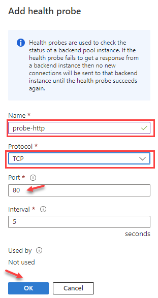
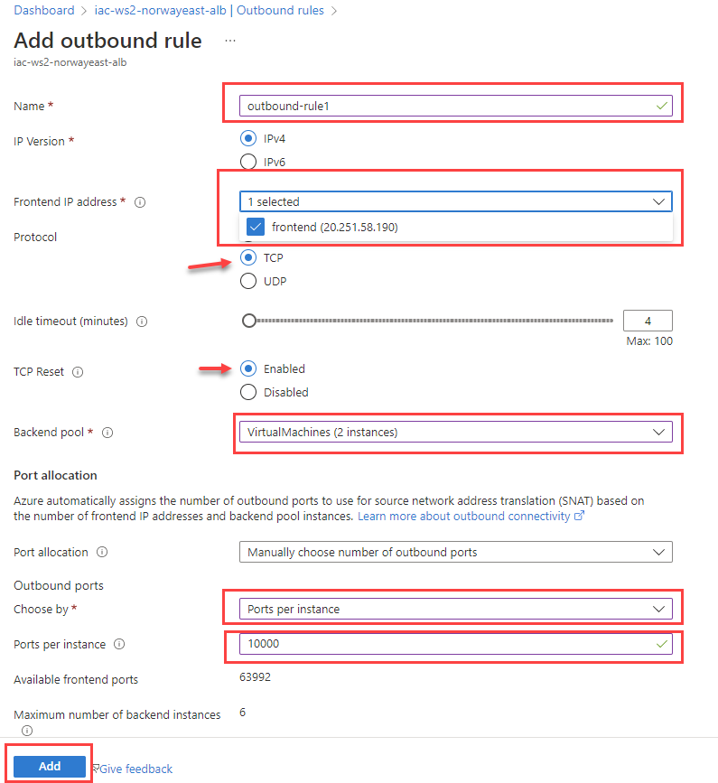

# lab-02 - working with Azure Load Balancer

Azure Load Balancer operates at layer 4 of the Open Systems Interconnection (OSI) model. It's the single point of contact for clients. Load balancer distributes inbound flows that arrive at the load balancer's front end to backend pool instances. These flows are according to configured load-balancing rules and health probes. The backend pool instances can be Azure Virtual Machines or instances in a Virtual Machine Scale Set. We will be using Virtual Machines during this lab.
* Azure load balancer supports two types of load balancing: `Basic` and `Standard`. We will be using `Standard` load balancer during this lab.
* Azure load balancer can be Internet-facing (aka Public) or internal. We will be using Public load balancer during this lab.

A public load balancer can provide outbound connections for virtual machines (VMs) inside your virtual network. These connections are accomplished by translating their private IP addresses to public IP addresses. Public Load Balancers are used to load balance internet traffic to your VMs.

In this lab you will learn how to:

* create a public Azure Load Balancer to load balance two Virtual Machines using portal
* add outbound rules to Azure Load Balancer using portal
* run load tests against load balancer using [Azure Load Testing](https://docs.microsoft.com/en-us/azure/load-testing/)]
* monitor Azure Load Balancer with Insights


## Task #1 - create a public Azure Load Balancer to load balance two Virtual Machines using portal

In this task, you'll create a public load balancer in `iac-ws2-norwayeast-rg` resource group that load balances `lab02-vm-no-0` and `lab02-vm-no-0` virtual machines.  

During the creation of the load balancer, you'll configure:

* Frontend IP address
* Backend pool
* Inbound load-balancing rule
* Health probe

At the portal, search for ``Load Balancer``


 In the `Load balancing` page, make sure that `Load Balancer` tab is selected and click `Create`.


In the `Basics` tab fill the following information:

| Field | Value |
| --- | --- |
| Subscription | Select your subscription |
| Resource group | Select `iac-ws2-norwayeast-rg` |
| Name | Enter `iac-ws2-norwayeast-alb` |
| Region | Select `Norway East` |
| SKU | Select `Standard` |
| Type | Select `Public` |
| Tier | Select `Regional` |


When done, click `Next: Frontend IP configuration >` and then click `+ Add a frontend IP configuration`


In the `Add frontend IP configuration` tab fill the following:

| Field | Value |
| --- | --- |
| Name | Enter `frontend` |
| IP version | Select `IPv4` |
| IP type | Select `IP address` |
| Public IP address | Select `iac-ws2-norwayeast-alb-pip` |
| Gateway Load Balancer | Select `None` |


Click `Add` and then navigate to  `Next: Backend pools`


At the `Backend pools` tab click `Add a backend pool` 


At the `Add backend pool` page fill the following:

| Field | Value |
| --- | --- |
| Name | Enter `VirtualMachines` |
| Virtual network | Select `iac-ws2-norwayeast-vnet` |
| Backend Pool Configuration | Select `NIC` |

Click `Add`


At the `Add IP configurations to backend pool` page select `lab02-vm-no-0` and `lab02-vm-no-1` virtual machines and click `Add`

 

At the `Add backend pool` page click `Save`

 

and at the `Backend pools` tab click `Next: Inbound rules`

 

At the `Inbound rules` page click `+ Add a load balancing rule`

 

At the `Add load balancing rule` page fill the following:

| Field | Value |
| --- | --- |
| Name | Enter `in-rule1` |
| IP Version | Select `IPv4` |
| Frontend IP address | Select `frontend` |
| Backed pool | Select `VirtualMachines` |
| Protocol | Select `TCP` |
| Port | Enter `80` |
| Backend port | Enter `80` |
| Health probe | Click `Create new` |

 

At the `Add health probe` page fill the following:

| Field | Value |
| --- | --- |
| Name | Enter `probe-http` |
| Protocol | Select `TCP` |
| Port | Enter `80` |
| Interval | Enter `5` |

Click `Ok` when finished.

 

At the `Add load balancing rule` page click `Add`. 
We're not going to configure outbound rules in this lab, so click `Review + create`

 

WHen Validation  passed, click `Create`

 


## Task #2 - test Azure Load Balancer

Now lets' test that Azure Load Balancer is working as expected.
First, find your public IP address of the load balancer frontend. You can either do it at the portal or using Azure CLI.

### Portal

Navigate to the `iac-ws2-norwayeast-alb` load balancer and open `Frontend IP configuration`.
. Copy the `IP address` value. For me that was `20.251.58.190`.

### Using az cli

```powershell
# get public ip address of load balancer frontend
az network public-ip show -n iac-ws2-norwayeast-alb-pip -g iac-ws2-norwayeast-rg  --query ipAddress -otsv
```

Now, let's use curl to test that load balancer is working as expected... 

```powershell   
# get public ip address of load balancer frontend
$albip=(az network public-ip show -n iac-ws2-norwayeast-alb-pip -g iac-ws2-norwayeast-rg  --query ipAddress -otsv)

# test load balancer
curl http://$albip
lab02-vm-no-0
``` 

If you run `curl` command several times, you'll see that the response is coming from different VMs which means that load balancer is working as expected.

## Task #3 - send some load to Azure Load Balancer using Azure Load Testing

Now that we know that Azure Load Balancer is working as expected, let's send some load to it using Azure Load Testing. We need some data later when we work with monitoring and insights.

Open `iac-ws2-tester` at the portal. You can either search for it or open it from the Dashboard. When opened, click `Quick test` at the `Seg started` tab of `Overview` page.


At the `Quick test` page fill the following:

| Field | Value |
| --- | --- |
| Test URL | Enter http://azure_load_balancer_publi_ip |
| Number of virtual users | Keep `5` |
| Test duration (Seconds) | Enter `1200` (20 min) |
| Ramp-up time (Seconds) | Keep `0` |


You can get Load Balancer frontend public ip address using the following command:

```powershell
# get load balancer frontend public ip address
az network public-ip show -n iac-ws2-norwayeast-alb-pip -g iac-ws2-norwayeast-rg  --query ipAddress -otsv
```


It also shows what will cost you to run this test. In this example, the test will consume 1.67 virtual user hours. Note that there are 50 Virtual User Hours (VUH) per month are included into monthly service fee. 

Click `Run test`. It will take some second for test to start. You can monitor the progress at the test run overview page.


Here is what you see at this page:

1. Start time shows when the test started
2. `Auto refresh on` shows how often the page will refresh itself
3. `Response time (5s)` shows the average response time from the load balancer to the test client
4. `Requests/sec (Avg)` shows the number of requests per second
5. `Errors (total)` shows the number of errors

Let it run while we are working with other tasks.


## Task #4 - add outbound rules to Azure Load Balancer using portal

Outbound rules allow you to explicitly define SNAT(source network address translation) for a public standard load balancer. This configuration allows you to use the public IP(s) of your load balancer to provide outbound internet connectivity for your backend instances.

Before we start with this task, let's test outbound connectivity from load balanced VMs (its enough with just one of them).

Remote to `iac-ws2-norwayeast-vm0` as we did it in [lab-01/task #4](../lab-01#task-4---remote-into-one-of-the-test-vms), start `Microsoft Edge` web browser and try to navigate to https://www.whatsmyip.org/


The connection should fail, because by default, standard public load balancer doesn't allow [outbound traffic without a defined outbound rule](https://learn.microsoft.com/en-us/azure/load-balancer/load-balancer-overview#securebydefault).

Now, let's create a public load balancer outbound rule. Navigate to the `iac-ws2-norwayeast-alb` load balancer , open `Outbound rules` page and click `Add`


At the `Add outbound rule` page fill the following:

| Field | Value |
| --- | --- |
| Name | Enter `outbound-rule1` |
| IP Version | Select `IPv4` |
| Frontend IP address | Select `frontend` |
| Protocol | Select `TCP` |
| TCP reset | Keep `Enabled` |
| Backend pool | Select `VirtualMachines` |
| Port allocation | Keep `Manually choose number of outbound ports` | 
| Choose by | Select `Ports per instance` |
| Ports per instance | Enter `10000` |



Click `Add`. Wait when changes are deployed and check that new rule is created.


Now, go back to the `iac-ws2-norwayeast-vm0` and try to navigate to https://www.whatsmyip.org/ again. This time it should show you public IP and it should the public IP of the load balancer frontend (`iac-ws2-norwayeast-alb-pip`).


## Task #3 - monitor Azure Load Balancer with Insights

* walk through the ALB Insights dashboard
* walk through the ALB Insights metrics
* stop one of the VMs and see how the load balancer reacts
* Azure Load Balancer metrics    

## Links

* [Quickstart: Create a public load balancer to load balance VMs using the Azure portal](https://learn.microsoft.com/en-us/azure/load-balancer/quickstart-load-balancer-standard-public-portal)
* [Backend pool management](https://learn.microsoft.com/en-us/azure/load-balancer/backend-pool-management)
* [Outbound rules Azure Load Balancer](https://learn.microsoft.com/en-us/azure/load-balancer/outbound-rules)
* [Monitoring load balancer](https://learn.microsoft.com/en-us/azure/load-balancer/monitor-load-balancer)

## Next
[Go to lab-03](../lab-03/readme.md)