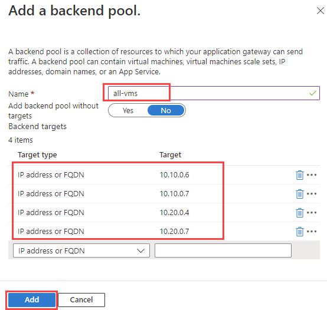
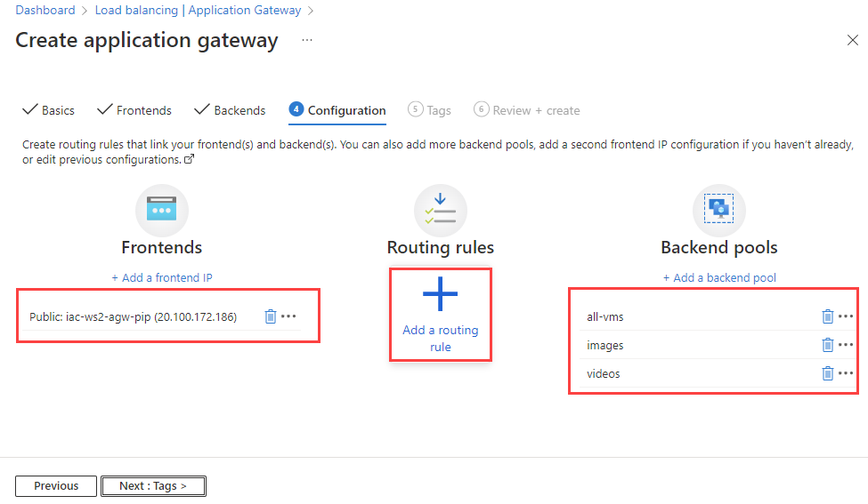
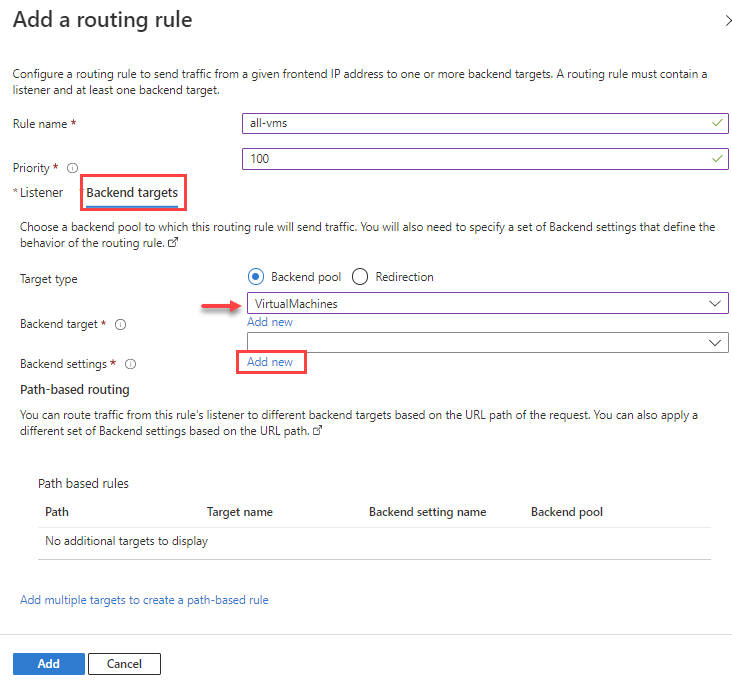

# lab-03 - working with Azure Application Gateway

Azure Application Gateway is a Level 7 load balancer that enables you to manage traffic to your web applications. Application Gateway offers advanced request routing capabilities, including URL-based and multi-site routing, as well as the ability to rewrite URLs and redirect HTTP to HTTPS. Application Gateway also provides advanced load balancing capabilities, including zone-redundant and active-active configurations, as well as the ability to scale to support very high traffic loads.


## Task #1 - create an Azure Application Gateway to load balance four Virtual Machines from two regions using portal

In this task you will create an Azure Application Gateway to load balance four Virtual Machines from two regions using portal. We already provisioned two Virtual Machines prefixed with `lab03-` in each region. 


We will need private IP addresses of these VMs to configure Application Gateway. You can either find them the portal, or use Azure CLI.

> Note! you will most likely get different IP addresses for your VMs!

```powershell
# Get private IP addresses of VMs
az vm list-ip-addresses -g iac-ws2-norwayeast-rg --query "[?contains(virtualMachine.name, 'lab03-')].{ip:virtualMachine.network.privateIpAddresses[0], vmName:virtualMachine.name}" -o table
Ip         VmName
---------  -------------
10.10.0.6  lab03-vm-no-0
10.10.0.5  lab03-vm-no-1

az vm list-ip-addresses -g iac-ws2-eastus-rg --query "[?contains(virtualMachine.name, 'lab03-')].{ip:virtualMachine.network.privateIpAddresses[0], vmName:virtualMachine.name}" -o table
Ip         VmName
---------  -------------
10.20.0.5  lab03-vm-us-0
10.20.0.6  lab03-vm-us-1
```

During the creation of the Application Gateway, you'll configure:

* Frontend IP
* Listener
* Backend pool
* Http Settings with probe
* Routing rule

At the portal, search for ``Application Gateway``


In the `Load balancing` page, make sure that `Application Gateway` tab is selected and click `+ Create`.


At the `Create application gateway` page, fill in the following values:

| Name | Value |
| --- | --- |
| Subscription | Select your subscription |
| Resource group | Select `iac-ws2-rg` |
| Application Gateway name | Enter `iac-ws2-agw` |
| Region | Select `Norway East` |
| Tier | Select `Standard V2` |
| Enable autoscaling | Select `No` |
| Instance count | Enter `1` |
| Availability zones | Select `None` |
| HTTP2 | Keep `Disabled` |
| Virtual network | Select `iac-ws2-vnet` |
| Subnet | Select `agw-snet` |


Click `Next: Frontends >` and at the `Frontends` tab fill in the following values:

| Name | Value |
| --- | --- |
| Frontend IP address type | Select `Public` |
| Public IP address | Select `iac-ws2-agw-pip` |


Click `Next: Backends >` and at the `Backends` tab click `+ Add backend pool`.:


At the `Add backend pool` page, fill in the following values:

| Name | Value |
| --- | --- |
| Name | Enter `all-vms` |
| Add backend pool without targets | Select `No` |

At the `Backend targets`, add four IP private addresses for our VMs. Use `IP address or FQDN` as a `Target type`.



Click `Add` when finished. 

Add new backend pool with the following values:

| Name | Value |
| --- | --- |
| Name | Enter `images` |
| Add backend pool without targets | Select `No` |

At the `Backend targets`, add two IP private addresses for VMs from `norwayeast` region. Use `IP address or FQDN` as a `Target type`.


Add new backend pool with the following values:

| Name | Value |
| --- | --- |
| Name | Enter `videos` |
| Add backend pool without targets | Select `No` |

At the `Backend targets`, add two IP private addresses for VMs from `eastus` region. Use `IP address or FQDN` as a `Target type`.


At this point, you should have three backend pools: `all-vm`, `images` and `videos`. 
From the `Backends` tab click `Next: Configuration >`


At the `Configuration` tab, make sure that there is one frontend with `iac-ws2-agw-pip` public IP address and three backend pools. Click `+ Add a routing rule`.



At the `Add routing rule -> Listeners` tab, fill in the following values:

| Name | Value |
| --- | --- |
| Rule name | Enter `all-vms` |
| Priority | Enter `100` |
| Listener name | Enter `listener1` |
| Frontend IP | Select `Public` |
| Protocol | Select `HTTP` |
| Port | Enter `80` |
| Listener type | Select `Basic` |  
| Error page url | Keep `No` |


When done at `Listeners` tab, click `Backend Targets` tab and fill in the following values:

| Name | Value |
| --- | --- |
| Target type | Enter `Backend pool` |
| Backend target | Select `VirtualMachines` |
| Backend settings | Click `Add new` |



At the `Add backend settings` page, fill in the following values:

| Name | Value |
| --- | --- |
| Backend settings name | Enter `http-settings` |
| Backend protocol | Keep `HTTP` |
| Backend port | Keep `80` |

Keep the rest of the settings with default values and click `Add` when done.


From the `Add a routing rule` page click `Add multiple targets to create a path-based rule`


At the `Add a path` page fill in the following values:

| Name | Value |
| --- | --- |
| Target type | Select `Backend pool` |
| Path | Enter `/images/*` |
| Target name | Enter `images` |
| Backend settings | Select  `http-settings` |
| Backend target | Select `images` |


Click `Add` when done.

Add new rule by clicking at `Add multiple targets to create a path-based rule` and at the `Add a path` page fill in the following values:

| Name | Value |
| --- | --- |
| Target type | Select `Backend pool` |
| Path | Enter `/videos/*` |
| Target name | Enter `videos` |
| Backend settings | Select  `http-settings` |
| Backend target | Select `videos` |


Click `Add` when done.

At the `Add routing rule` page click `Add`.


At the `Create application gateway` page click `Next: Tags >` then `Next: Review + create >` and finally `Create`. 
It will take a few minutes to create the Application Gateway.


## Task #2 - test Application Gateway

Now let's test our Application Gateway. We need to get the public IP address of the Application Gateway first. You can find it at the Application Gateway Overview page at the portal.


Or you can use `az cli` to get the public IP address of the Application Gateway.

```powershell
# get public ip address of application gateway
az network public-ip show -n iac-ws2-agw-pip -g iac-ws2-rg  --query ipAddress -otsv
```
Now, let's use curl to test application gateway. 

```powershell   
# get public ip address of application gateway
$agwpip=(az network public-ip show -n iac-ws2-agw-pip -g iac-ws2-rg  --query ipAddress -otsv)

# test app gateway
curl http://$agwpip
lab03-vm-no-0
``` 

If you run `curl` command several times, you'll see that the response is coming from different VMs...


## new listener, 2 new pools no and us. new rule that orchestrates traffic /no /en

## read headers and redirect traffic to pools

## enrich response with new headers

## Links

* [What is Azure Application Gateway?](https://learn.microsoft.com/en-us/azure/application-gateway/overview)
* [Application gateway components](https://learn.microsoft.com/en-us/azure/application-gateway/application-gateway-components)
* [Azure Well-Architected Framework review - Azure Application Gateway v2](https://learn.microsoft.com/en-us/azure/architecture/framework/services/networking/azure-application-gateway)


https://learn.microsoft.com/en-us/azure/application-gateway/how-application-gateway-works

routing rules
https://learn.microsoft.com/en-us/azure/application-gateway/application-gateway-components#request-routing-rules
https://learn.microsoft.com/en-us/azure/application-gateway/url-route-overview

https://learn.microsoft.com/en-us/azure/application-gateway/quick-create-bicep?tabs=CLI

https://learn.microsoft.com/en-us/azure/virtual-machines/extensions/custom-script-windows
https://learn.microsoft.com/en-us/azure/application-gateway/quick-create-portal

## Next
[Go to lab-04](../lab-04/readme.md)