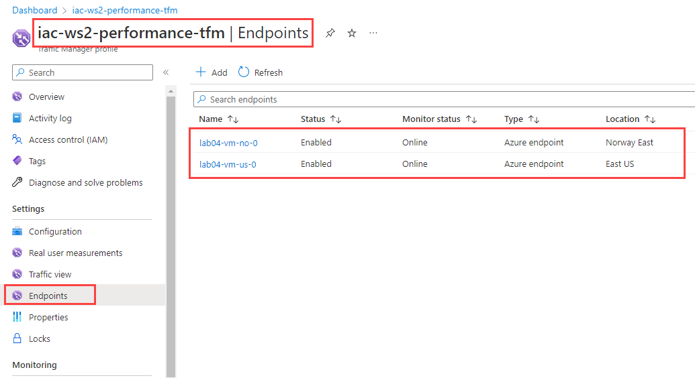

# lab-04 - working with Azure Traffic Manager

Azure Traffic Manager is a DNS-based traffic load balancer that enables you to distribute traffic optimally to your public services and applications across a global network. Traffic Manager provides high availability and responsiveness by monitoring the health of services and rerouting traffic in real time to ensure that end users have the best possible experience.

Traffic Manager uses DNS to direct client requests to the appropriate service endpoint based on a traffic-routing method. Traffic manager also provides health monitoring for every endpoint. The endpoint can be any Internet-facing service hosted inside or outside of Azure. Traffic Manager provides a range of [traffic-routing methods](https://learn.microsoft.com/en-us/azure/traffic-manager/traffic-manager-routing-methods). And in this lab you will be working with the following methods:

* Performance traffic-routing method
* Priority traffic-routing method
* Weighted traffic-routing method

You will also be working with [Nested Traffic Manager profiles](https://learn.microsoft.com/en-us/azure/traffic-manager/traffic-manager-nested-profiles)

For this lab we will be using Azure CLI to provision the resources. 

## Task #1 - create a Traffic Manager profile with Performance routing method

With the 'Performance' traffic-routing method, you can route traffic to the location that is 'closest' to you.


First, create a traffic manager profile with performance routing using the following command:

```powershell
# Check dns name availability
 az network traffic-manager profile check-dns --name iac-ws2-performance-tfm --query nameAvailable -otsv

# If true, create a traffic manager profile with performance routing
az network traffic-manager profile create --name iac-ws2-performance-tfm --resource-group iac-ws2-rg --routing-method Performance --unique-dns-name iac-ws2-performance-tfm --ttl 30
```

If `check-dns` command returns false, then you need to choose a different name for your traffic manager profile, because the name you chose is already taken. 

Now, let's add two endpoints to the traffic manager profile. We will be using two Virtual Machines `lab04-vm-no-0` and `lab04-vm-us-0`. They are located in different regions and both have Public IP addresses and therefore can be used as endpoints for the traffic manager profile. 

```powershell
# Get public IP resource id associated with lab04-vm-no-0 VM
$vmNoPipResourceId=(az network public-ip show --name lab04-vm-no-pip-0 --resource-group iac-ws2-norwayeast-rg --query id -otsv)

# Add endpoints to the traffic manager profile
az network traffic-manager endpoint create --name lab04-vm-no-0 --profile-name iac-ws2-performance-tfm --resource-group iac-ws2-rg --type azureEndpoints --target-resource-id $vmNoPipResourceId --endpoint-status Enabled

# Get public IP resource id associated with lab04-vm-us-0 VM
$vmUsPipResourceId=(az network public-ip show --name lab04-vm-us-pip-0 --resource-group iac-ws2-eastus-rg --query id -otsv)

# Add endpoints to the traffic manager profile
az network traffic-manager endpoint create --name lab04-vm-us-0 --profile-name iac-ws2-performance-tfm --resource-group iac-ws2-rg --type azureEndpoints --target-resource-id $vmUsPipResourceId --endpoint-status Enabled

# Get all endpoints associated with the traffic manager profile
az network traffic-manager endpoint list --profile-name iac-ws2-performance-tfm --resource-group iac-ws2-rg --query "[].{name:name, status:endpointStatus, priority:priority}" -o table
```

You can also find endpoints in the Azure portal. NAvigate to your Traffic Manager profile and click on the Endpoints tab.



Now let's test the traffic manager profile. We will be using our test VMs `testvm-no` and `testvm-us`. First, lets test connectivity to the traffic manager profile from the `testvm-no` VM. Remote into `testvm-no`. Use `jamesbond` as the username and the password we stored at the keyvault

```powershell
# Get keyvault name 
$kvName = (az keyvault list -g iac-ws2-rg --query [0].name -otsv)

# check kv name 
echo $kvName

# Get Admin password from the KV
az keyvault secret show --name vmadmin-password --vault-name $kvName  --query value -otsv
```

Get the Traffic Manager profile URL.

```powershell
# Get Traffic Manager profile URL
az network traffic-manager profile show --name iac-ws2-performance-tfm --resource-group iac-ws2-rg --query dnsConfig.fqdn -otsv
```

When at the `testvm-no`, start `Powershell` and run the following command:

```powershell
# Test connectivity to the traffic manager profile  
(Invoke-WebRequest -Uri http://iac-ws2-performance-tfm.trafficmanager.net).Content
lab04-vm-no-0
```

Repeat the same test from the `testvm-us` VM. You script should return `lab04-vm-us-0` as a result.

This is because the traffic manager profile is routing traffic to the closest endpoint. `testvm-no` is closer to the `lab04-vm-no-0` endpoint and `testvm-us` is closer to the `lab04-vm-us-0` endpoint.

Keep remote connection active for both test VMs and stop `lab04-vm-no-0` VM. 

```powershell	
# Stop lab04-vm-no-0 VM
az vm stop --name lab04-vm-no-0 --resource-group iac-ws2-norwayeast-rg
```
When stopped, go back to both test VMs and re-run connectivity command again. You should receive `lab04-vm-us-0` at both test VMs, because now traffic manager is falling back to only one endpoint available (`lab04-vm-us-0`).


## Priority

## Weighted


## Links

* [What is Traffic Manager?](https://learn.microsoft.com/en-us/azure/traffic-manager/traffic-manager-overview)
* [Traffic Manager routing methods](https://learn.microsoft.com/en-us/azure/traffic-manager/traffic-manager-routing-methods)
* [Tutorial: Improve website response using Traffic Manager](https://learn.microsoft.com/en-us/azure/traffic-manager/tutorial-traffic-manager-improve-website-response)
* [Nested Traffic Manager profiles](https://learn.microsoft.com/en-us/azure/traffic-manager/traffic-manager-nested-profiles)

## Next
[Go to lab-05](../lab-05/readme.md)