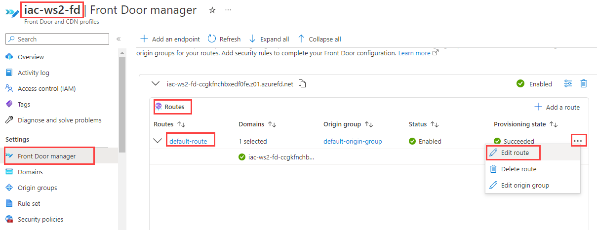
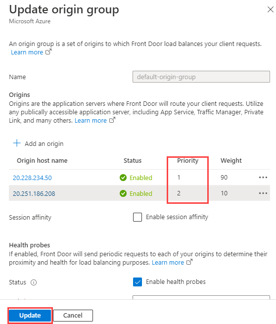

# lab-04 - working with Azure Front Door

Azure Front Door is a fully managed, high-performance web application accelerator that provides global load balancing, multi-site origin hosting, and end-to-end HTTP/HTTPS.

Same as Traffic Manager, Front Door supports four different traffic routing methods to determine how your HTTP/HTTPS traffic is distributed between different origins (backends). These methods are:

* Latency 
* Priority
* Weighted
* Session Affinity

In this lab we will be working with first three methods.


## Task #1 - create Azure Front Door profile with Lowest latencies based traffic-routing method

The latency-based routing ensures that requests are sent to the lowest latency origins acceptable within a sensitivity range. In other words, requests get sent to the nearest set of origins in respect to network latency.

> Note. Each Front Door environment measures the origin latency separately. This means that different users in different locations are routed to the origin with the best performance for that environment. That means that you might see different results when you test it.

Navigate to the portal, search for Azure Front Door and create a new instance. 


At the nest page, select `Azure Front Door`, `Quick create` and click `Continue to create a Front Door`.


At the `Basic` tab of `Create a Front Door profile` page, enter the following values:

| Name | Value |
| --- | --- |
| Subscription  | Select your subscription |
| Resource group | Select `iac-ws2-rg` |
| Name | Enter `iac-ws2-afd` |
| Tier | Select `Standard` |
| Endpoint name | Enter `iac-ws2-fd` |
| Origin type | Select `Public IP Address` |
| Origin hot name | Select `lab04-vm-no-pip-0` |
| Caching | Keep `Unchecked` |
| WAF policy | Keep empty |

Click `Review + create` and then `Create`.


When provisioned, goto `Origin groups`,  select `default-origin-group` and click `Configure origin group`


At the moment, there is only one origin (Public IP of the `lab04-vm-no-0` VM) in this group. Let's add another VM into the group. Click `Add an origin`


At the `Add an origin` page, enter the following values:

| Name | Value |
| --- | --- |
| Name | Enter `lab04-vm-us-0` |
| Origin type | Select `Public IP Address` |
| Host name | Select `lab04-vm-us-pip-0` |

Keep the rest of the fields with default values and click `Add`.


Click `Update`.


Now let's configure route. Got to `Front Door Manager`, at the `Routes` tab select `default-route` and click `Edit route`.



At the `Update route` page set `Forwarding protocol` to `HTTP only`. This is because our backed (or origin in Front Door terminology) is not configured to support HTTPS. Click `Update`.

Now Front Door is configured to load balance traffic to two VM in two different regions. Let's test it.

```powershell
# Get Front Door endpoint URL
$afdUrl = (az afd endpoint show --endpoint-name iac-ws2-fd --profile-name iac-ws2-fd --resource-group iac-ws2-rg --query hostName --output tsv)

# print url
echo $afdUrl

# Invoke Front Door endpoint
curl https://$afdUrl

# Should return lab04-vm-no-0

# Invoke Front Door endpoint in a loop
while ($true) { curl https://$afdUrl; sleep 1; }
```

All responses should be from `lab04-vm-no-0` VM. 

Now let's set latency sensitivity to more relaxed value. Go back to `Configure Origin Group` page, at the `Load balancing` section set the `Latency sensitivity (in milliseconds)` to 300 and click `Update`  

> Note. This is just for experimentation and doesn't mean that you should use it in your environment :) 


Re-run test command.

```powershell
# Invoke Front Door endpoint in a loop
while ($true) { curl https://$afdUrl; sleep 1; }
```

This time it should almost evenly show output from lab04-vm-us-0 and lab04-vm-no-0 VMs.

## Task #2 - configure origins with Weighted traffic-routing method

The weighted routing method allows you to specify the percentage of traffic that should be sent to each origin. This method is useful when you want to send more traffic to a specific origin, or when you want to send traffic to a specific origin for a specific period of time.

Open `Update origin group` page again and click `Edit` origin


set `Weight` to 10 and 90 for `lab04-vm-no-0` and `lab04-vm-us-0` origins respectively


Make sure that `Latency sensitivity (in milliseconds)` is still set to 300 and click `Update`.

Re-run test command and observe the output. 

```powershell
# Invoke Front Door endpoint in a loop
while ($true) { curl https://$afdUrl; sleep 1; }
```

You should see more responses from the origin with higher weight.


## Task #3 - configure origins with Priority-based traffic-routing method

The priority routing method allows you to specify the priority of each origin. 
The default Azure Front Door contains an equal priority list of origins. By default, Azure Front Door sends traffic only to the top priority origins (lowest value in priority) as the primary set of origins. If the primary origins aren't available, Azure Front Door routes the traffic to the secondary set of origins (second lowest value for priority). If both the primary and secondary origins aren't available, the traffic goes to the third, and so on. Availability of the origin is based on the configured status of enabled or disabled and the ongoing origin health status as determined by the health probes.

Open `Update origin group` page again and set `Priority` to 1 and 2 for `lab04-vm-us-0` and `lab04-vm-no-0` origins respectively.



Re-run test command. 

```powershell
# Invoke Front Door endpoint in a loop
while ($true) { curl https://$afdUrl; sleep 1; }
```

Now all responses should be from `lab04-vm-us-0` VM. Now, let's stop the `lab04-vm-us-0` VM and re-run the test command. 

```powershell
# stop lab04-vm-us-0 VM
az vm stop --name lab04-vm-us-0 --resource-group iac-ws2-eastus-rg

# Invoke Front Door endpoint in a loop
while ($true) { curl https://$afdUrl; sleep 1; }
```
You should see that now all responses are coming from `lab04-vm-no-0` VM.

## Links

* [What is Azure Front Door?](https://learn.microsoft.com/en-us/azure/frontdoor/front-door-overview)
* [Azure Front Door edge locations by metro](https://learn.microsoft.com/en-us/azure/frontdoor/edge-locations-by-region)
* [Quickstart: Create an Azure Front Door Standard/Premium - Azure CLI](https://learn.microsoft.com/en-us/azure/frontdoor/create-front-door-cli)
* [Traffic routing methods to origin](https://learn.microsoft.com/en-us/azure/frontdoor/routing-methods)
* [Routing architecture overview](https://learn.microsoft.com/en-us/azure/frontdoor/front-door-routing-architecture?pivots=front-door-standard-premium)
* [Solution architecture](https://learn.microsoft.com/en-us/azure/frontdoor/scenarios#solution-architecture)
* [Overall decision flow](https://learn.microsoft.com/en-us/azure/frontdoor/routing-methods#overall-decision-flow)
* [Azure CLI](https://learn.microsoft.com/en-us/cli/azure/afd?view=azure-cli-latest)

## Next
[Go to lab-06](../lab-06/readme.md)