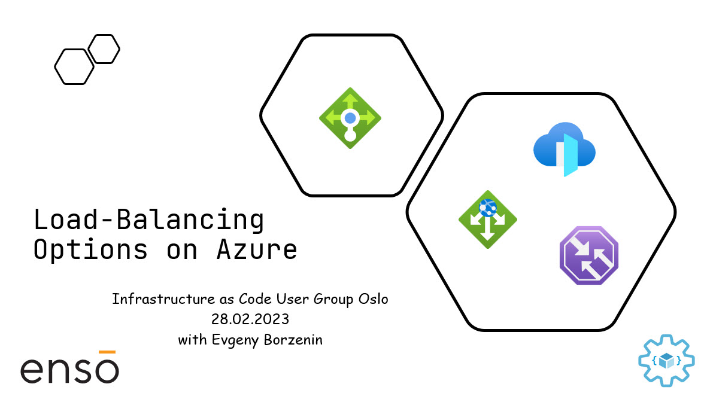

# Load-balancing options on Azure

This is level 200 workshop that covers different aspects of working with load-balancing services on Azure and you will learn:

* What load-balancing options are available on Azure
* How to choose a load balancing solution for your workload
* What traffic routing methods are available at Azure Front Door
* How to implement canary releases with Azure Traffic Manager
* How to rewrite HTTP headers and URL with Azure Application Gateway

and many many more...

## Agenda
 
* Welcome + practical information
* [Slides] - Load-balancing options on Azure
* [Lab-01](labs/lab-01/readme.md) - provision workshop infrastructure
* [Lab-02](labs/lab-02/readme.md) - working with Azure Load Balancer
* [Lab-03](labs/lab-03/readme.md) - working with Azure Application Gateway
* [Lab-04](labs/lab-04/readme.md) - working with Azure Traffic Manager
* [Lab-05](labs/lab-05/readme.md) - working with Azure Front Door
* [Lab-07](labs/lab-07/readme.md) - cleaning up resources
  
## Links

* [Prerequisites](prerequisites.md)

## Feedback

* Visit the [Github Issue](https://github.com/evgenyb/iac-workshops/issues/4) to comment on this workshop. 
