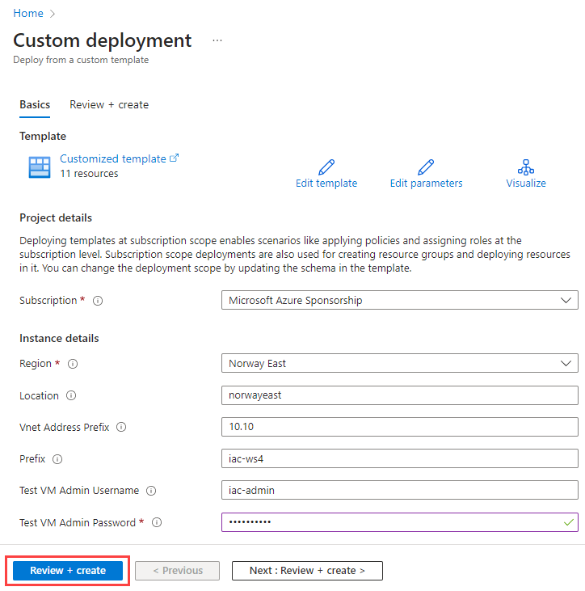
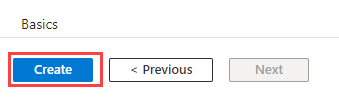
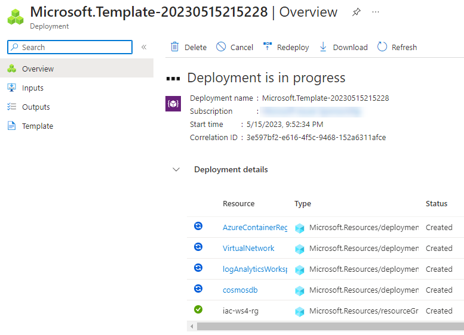
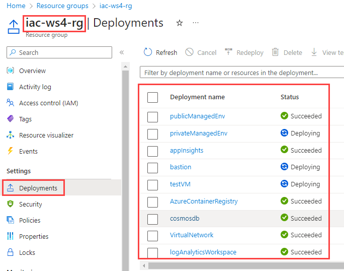
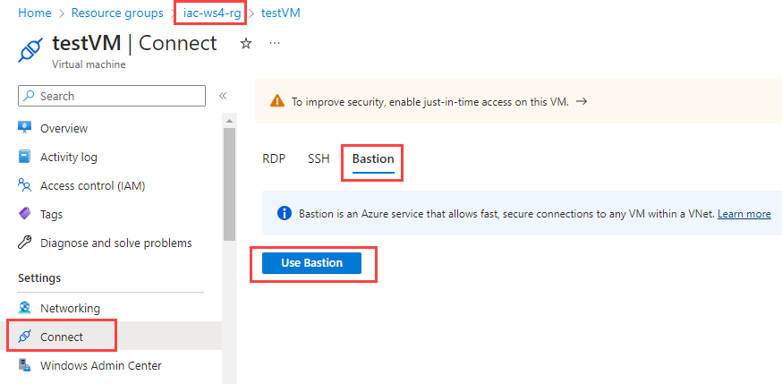
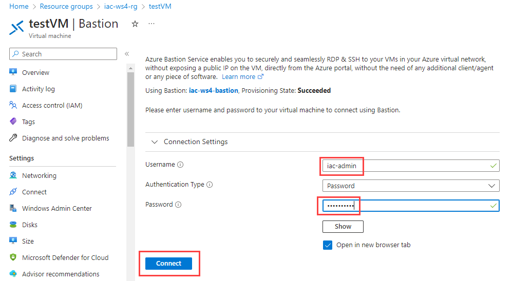

# lab-01 - provision lab environment

As always, we need to provision lab environment before we can start working on the lab tasks. Statistically, we spend at least one hour during the workshop provisioning resources we need during the workshop. Therefore, this time, we do it even more differently than before. That is - you will provision a most time consuming resources prior the workshop day. Here are the reasons:

- It will help us to avoid issues with Azure subscription or regional limits.
- It will allow us to focus on the workshop tasks during the workshop day.

If you find any issues with provisioning lab environment under your subscription (hit the limits, resource is not available under your region, template errors etc...), please reach out to me at evgeny.borzenin@gmail.com, via Teams at evgeny@enso.no or describe your issue under [Comments to "Workshop - Working with Azure Container Apps"](https://github.com/evgenyb/iac-workshops/issues/9) issue.

I suggest that you try provisioning lab environment at least one week before the workshop day. It will give us time to fix any issues you may have. If provisioning went well and all connectivity tests passed, you can safely delete all resources (to minimize the costs) and re-deploy them again one day before the workshop.

Lab environment is implemented using [Bicep](https://learn.microsoft.com/en-us/azure/azure-resource-manager/bicep/overview?tabs=bicep) and code is located under [iac](../../iac/) folder. Most of the resources are implemented as [Bicep modules](https://learn.microsoft.com/en-us/azure/azure-resource-manager/bicep/modules). The master orchestration Bicep file is [infra.bicep](../../iac/infra.bicep). It orchestrates deployment of the following resources:

- Private Virtual Network
- Azure Bastion
- Azure Private DNS Zone
- Virtual Machine that we will use for testing
- Azure Cosmos DB
- Azure Container Registry
- Azure Container Apps Managed Environment for public Container Apps
- Azure Container Apps Managed Environment for private Container Apps
- Azure Storage Account

You can learn implementation details and code structure, but for efficiency reasons, I also pre-built Bicep template into ARM template and allows you to deploy it right from Azure portal. You can find the master template [here](https://raw.githubusercontent.com/evgenyb/iac-workshops/ws/aca-v1/container-apps/iac/infra.json). 

## Task #1 - register required resource providers

Before we deploy lab resources, we need to make sure that we register all required resource providers. This is a one time operation per subscription.

```powershell
az provider register -n Microsoft.ContainerService
az provider register -n Microsoft.ContainerRegistry
az provider register -n Microsoft.Network
az provider register -n Microsoft.OperationalInsights
az provider register -n Microsoft.App
az provider register -n Microsoft.Storage
az provider register -n Microsoft.ManagedIdentity
az provider register -n Microsoft.Compute
az provider register -n microsoft.insights
az provider register -n Microsoft.DocumentDB
```

## Task #2 - deploy lab environment

You can deploy all resources using the following button:

<a href="https://portal.azure.com/#create/Microsoft.Template/uri/https%3A%2F%2Fraw.githubusercontent.com%2Fevgenyb%2Fiac-workshops%2Fws%2Faca-v1%2Fcontainer-apps%2Fiac%2Finfra.json" target="_blank"></a>

It will open Azure portal and ask you to provide the following parameters:

| Parameter name | Description |
| --- | --- |
| Subscription | Your Azure subscription where you want to deploy your lab environment |
| Region | Your Azure region. Default is `Norway East` |
| Location | Your Azure region. Default is `norwayeast` |
| Vnet Address Prefix | The first two octets of the Virtual Network Address prefix. The default value is `10.10`, which will make Virtual Network Address Prefix as `10.10.0.0/22`  |
| Prefix | All resources will be prefixed with this value. Default value is `iac` |
| Test VM Admin Username | Default value is `iac-admin`  |
| Test VM Admin Password | Test VM admin user password  |

I recommend you to keep the default values. When all parameters are set, click `Review + create` button. 



If validation is passed, click `Create`.



The deployment will start and will take around 10 minutes.



 You can monitor deployment either under Subscription `Deployments` tab, you can go to `iac-ws4-rg` resource group and monitor deployment under `Deployments` tab.



## Task #3 - connect to the test VM

Under the `iac-ws4-rg` resource group, open your `testVM` Virtual Machine, navigate to  `Settings->Connect` section and select `Bastion` tab and click `Use Bastion`.



In the new window, enter your test VM admin username and password and click `Connect`. If you used default parameters during provisioning, admin username is `iac-admin`, otherwise use the one you specified and click `Connect`.



If everything is fine, you will be connected to the test VM. 
Stay connected to the test VM, we will use it during the next task.

## Task #4 - test private DNS Zone

From your PC, run the following commands

```powershell
# Get private DNS Zone fqdn
az network private-dns zone list -g iac-ws4-rg --query [0].name -otsv

# Try to resolve private DNS Zone fqdn
nslookup <private DNS Zone fqdn from the previous command>
```

You will get something like

> can't find something-something.norwayeast.azurecontainerapps.io: Non-existent domain

Now, copy private DNS Zone fqdn from the previous command and try to resolve it from the test VM.

```powershell
# Try to resolve private DNS Zone fqdn
nslookup <private DNS Zone fqdn from the previous command>
```

This time you will get the correct response that looks something like

```txt
nslookup -type=SOA something-something.norwayeast.azurecontainerapps.io
Server:  UnKnown
Address:  168.63.129.16

Non-authoritative answer:
something-something.norwayeast.azurecontainerapps.io
        primary name server = azureprivatedns.net
        responsible mail addr = azureprivatedns-host.microsoft.com
        serial  = 1
        refresh = 3600 (1 hour)
        retry   = 300 (5 mins)
        expire  = 2419200 (28 days)
        default TTL = 10 (10 secs)
```

You can disconnect from your test VM.

## Task #5 - build and push application image to ACR

Now let's test that you can build and push images to ACR

```powershell
# get your acr name
$acrName = (az acr list -g iac-ws4-rg  --query [0].name -otsv)

# login into acr
az acr login -n $acrName

# cd to the todo folder
cd container-apps\src\apps\todo

# make sure that you are at the correct folder
pwd

# build image
docker build -t todo:latest -f Dockerfile ..

# Tag the image with the full ACR login server name. 
docker tag todo:latest "$acrName.azurecr.io/todo:latest"

# Push the image to the ACR instance.
docker push "$acrName.azurecr.io/todo:latest"
```

### Deploy test app

<a href="https://portal.azure.com/#create/Microsoft.Template/uri/https%3A%2F%2Fraw.githubusercontent.com%2Fevgenyb%2Fiac-workshops%2Fws%2Faca-v1%2Fcontainer-apps%2Fiac%2Fapps.json" target="_blank"></a>

### Test api

```powershell
# get private dns zone name
$dnsZoneName = (az network private-dns zone list -g iac-ws4-rg --query [0].name -otsv)

# test api 
curl https://iac-ws4-test-capp.$dnsZoneName/health
```

You should get `ok` response.
