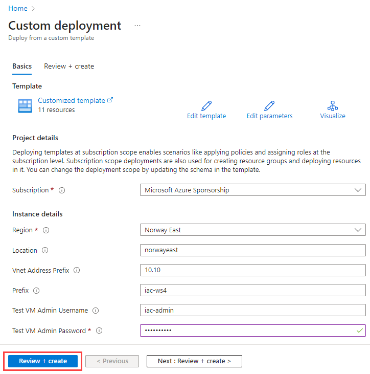
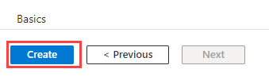
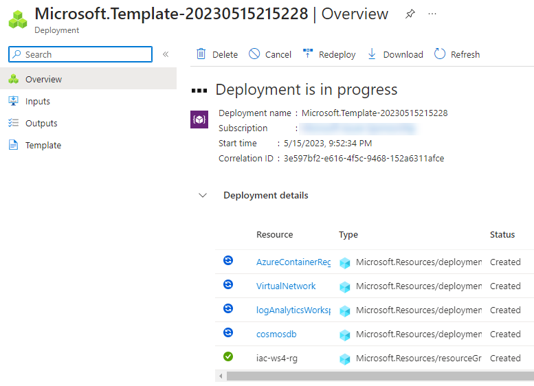
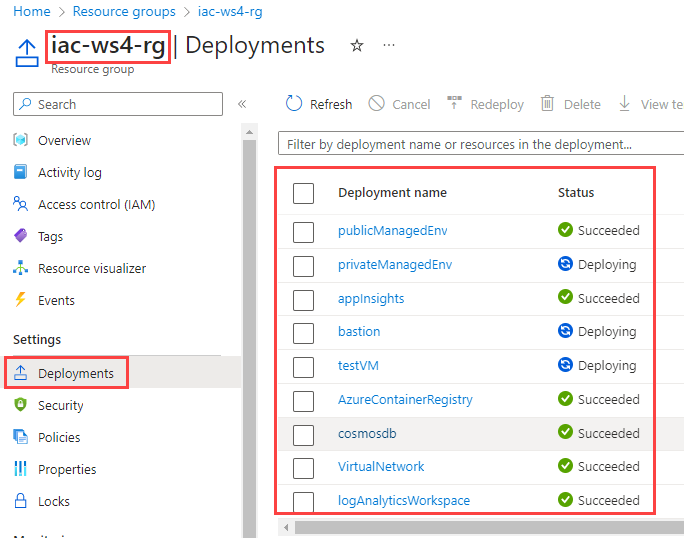
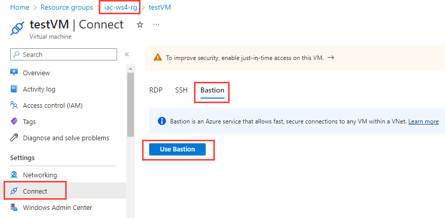
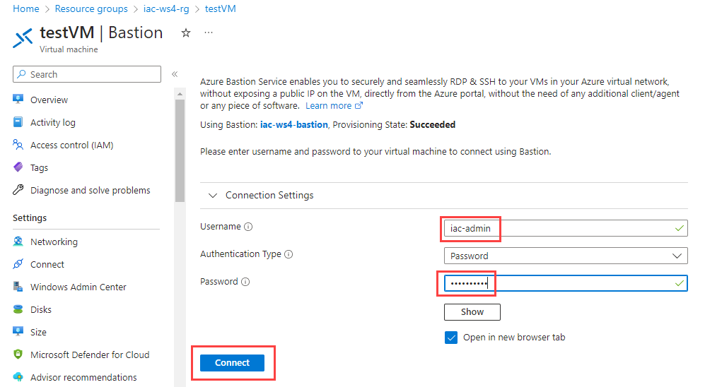

# Dry-run of provisioning of lab environment

As always, we need to provision lab environment before we can start working on the lab tasks. Statistically, based on previous workshops experience, we spent at least one hour to provision lab resources.
This time, we do it differently. That is - you will provision a most time consuming resources prior the workshop day. 
This way:

- It will help us to avoid issues with Azure subscription or regional limits.
- It will allow us to focus on the workshop tasks during the workshop day.

If you will find any issues with provisioning lab environment under your subscription (hit the limits, resource is not available under your region, template errors etc...), please reach out to me at evgeny.borzenin@gmail.com.

I suggest that you try provisioning lab environment at least one week before the workshop day (23.05.2023). It will give me time to fix any issues we may have. If provisioning went well and all connectivity tests passed, you can safely delete all resources to minimize the costs, and re-deploy them again one day before the workshop.

Infrastructure for Lab environment is implemented using [Bicep](https://learn.microsoft.com/en-us/azure/azure-resource-manager/bicep/overview?tabs=bicep) and code is located under [iac](./iac/) folder. Most of the resources are implemented as [Bicep modules](https://learn.microsoft.com/en-us/azure/azure-resource-manager/bicep/modules). The master orchestration Bicep file is [infra.bicep](./iac/infra.bicep). It orchestrates deployment of the following resources:

- Private Virtual Network
- Azure Bastion
- Azure Private DNS Zone
- Virtual Machine for testing
- Azure Container Registry
- Azure Container Apps Managed Environment for public Container Apps
- Azure Container Apps Managed Environment for private Container Apps
- Azure Cosmos DB
- Azure Storage Account
- Azure Key Vault

You can learn implementation details and code structure, but for the efficiency reasons, I pre-built `Bicep` code into `ARM template` and made it possible to deploy it right from Azure portal.

## Task #1 - register required resource providers

Before we deploy lab resources, we need to make sure that we register all required resource providers. This is a one time operation per subscription.

```powershell
# Make sure you are at the correct Subscriptions
az account show

# If needed, switch to the correct Subscription
az account set --subscription <your subscription id>

# Register required resource providers
az provider register -n Microsoft.ContainerService
az provider register -n Microsoft.ContainerRegistry
az provider register -n Microsoft.Network
az provider register -n Microsoft.OperationalInsights
az provider register -n Microsoft.App
az provider register -n Microsoft.Storage
az provider register -n Microsoft.ManagedIdentity
az provider register -n Microsoft.Compute
az provider register -n microsoft.insights
az provider register -n Microsoft.DocumentDB
```

## Task #2 - deploy lab environment

Deploy all resources by cliking `Deploy to Azure` button below. Do a `CTRL+click` (on Windows and Linux) or `CMD+click` (on MacOS) on the link to open it in new window (tab).

<a href="https://portal.azure.com/#create/Microsoft.Template/uri/https%3A%2F%2Fraw.githubusercontent.com%2Fevgenyb%2Fiac-workshops%2Fmain%2Fcontainer-apps%2Fiac%2Finfra.json" target="_blank"></a>

It will open Azure portal and ask you to provide the following parameters:

| Parameter name | Description |
| --- | --- |
| Subscription | Azure Subscription where you want to deploy your lab environment |
| Region | Your Azure region. For me the default value is `Norway East` |
| Location | Your Azure region. Default is `norwayeast` |
| Vnet Address Prefix | The first two octets of the Virtual Network Address prefix. The default value is `10.10`, which will make Virtual Network Address Prefix as `10.10.0.0/22`  |
| Prefix | All resources will be prefixed with this value. Default value is `iac` |
| Test VM Admin Username | Default value is `iac-admin`  |
| Test VM Admin Password | Test VM admin user password  |

I recommend you to keep the default values.
When all parameters are set, click `Review + create` button.



If validation is passed, click `Create`.



The deployment will start and will take approx. 10 minutes.



 You can monitor deployment either under Subscription `Deployments` tab or you can go to `iac-ws4-rg` resource group and monitor deployment under `Deployments` tab.



## Task #3 - connect to the test VM

Let's test that you can connect to the test VM.
Under the `iac-ws4-rg` resource group, open your `testVM` Virtual Machine, navigate to `Settings -> Connect` section, select `Bastion` tab and click `Use Bastion`.



In the new window, enter your test VM admin username and password and click `Connect`. If you used default parameters during provisioning, admin username is `iac-admin`, otherwise use the one you specified.



If everything is fine, you will be connected to the test VM.

Start PowerShell session and stay connected to the test VM, we will use it during the next task.

## Task #4 - test private DNS Zone

From your PC, run the following commands

```powershell
# Get Container Apps private DNS Zone fqdn
az network private-dns zone list -g iac-ws4-rg --query [0].name -otsv

# Try to resolve fqdn
nslookup -type=SOA <private DNS Zone fqdn from the previous command>
```

You will get response that looks something like

> can't find something-something.norwayeast.azurecontainerapps.io: Non-existent domain

Now, copy private DNS Zone fqdn from the previous command and try to resolve it from the test VM.

```powershell
# Try to resolve private DNS Zone fqdn
nslookup -type=SOA <private DNS Zone fqdn from the previous command>
```

This time you will get the correct response that looks something like

```txt
nslookup -type=SOA something-something.norwayeast.azurecontainerapps.io
Server:  UnKnown
Address:  168.63.129.16

Non-authoritative answer:
something-something.norwayeast.azurecontainerapps.io
        primary name server = azureprivatedns.net
        responsible mail addr = azureprivatedns-host.microsoft.com
        serial  = 1
        refresh = 3600 (1 hour)
        retry   = 300 (5 mins)
        expire  = 2419200 (28 days)
        default TTL = 10 (10 secs)
```

You can now disconnect from your test VM.

## Task #5 - build and push application image to ACR

Now let's test that you can build and push images to ACR

```powershell
# Get your acr name
$acrName = (az acr list -g iac-ws4-rg  --query [0].name -otsv)

# cd to the todo app folder
cd container-apps\src\apps\todo

# make sure that you are at the correct folder
pwd

# build and publish container image with az acr build command
az acr build --registry $acrName --image todo:latest --file Dockerfile ..
```

## Task #6 - make a printscreen of resources under your `iac-ws4-rg` resource group and send it to me at `evgeny.borzenin@gmail.com`. 

## Task #7 - delete lab infrastructure

Now, when you tested that you can:
- provision all lab resources
- connect to the test VM
- resolve private DNS Zone from the test VM
- build and push images to ACR

you can delete all lab resources to minimize the costs. You will provision all resources again prior the workshop day.

```powershell
# Remove all resources that were created during the workshop
az group delete --name iac-ws4-rg --yes
```
