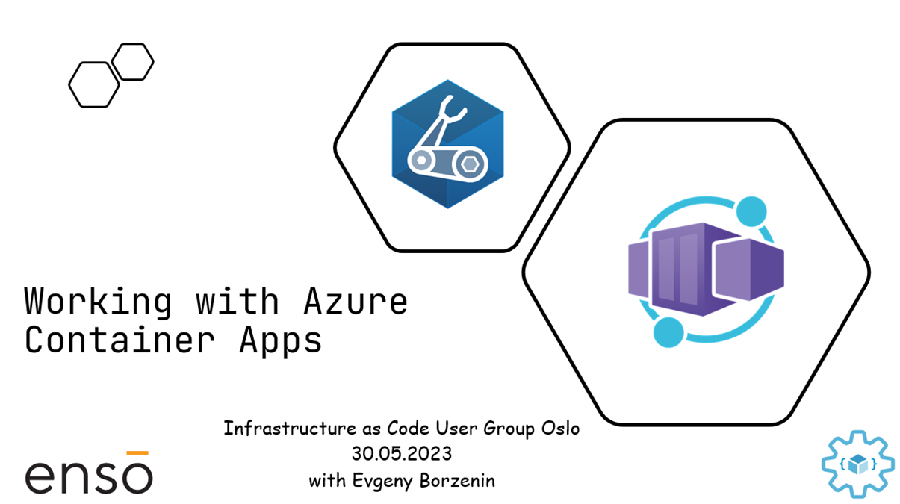

# Working with Azure Container Apps

This is level 200 workshop that covers different aspects of working with [Azure Container Apps](https://learn.microsoft.com/en-GB/azure/container-apps/overview) where you will learn:

- How to provision Azure Container Apps using Bicep
- How to provision Azure Container Apps with public ingress
- How to provision Azure Container Apps with ingress only accessible from within your Virtual Network
- How to deploy containerized applications to Azure Container Apps
- What observability options are available for Azure Container Apps
- How to scale your application
- How to implement blue/green deployment of your application
- How to use storage mounts in Azure Container Apps

## Agenda

Will be provided soon

## Links

- [Workshop prerequisites](prerequisites.md)
- [Azure Container Apps overview](https://learn.microsoft.com/en-GB/azure/container-apps/overview)

## Feedback

- Visit the [Github Issue](https://github.com/evgenyb/iac-workshops/issues/7) to comment on this workshop.
