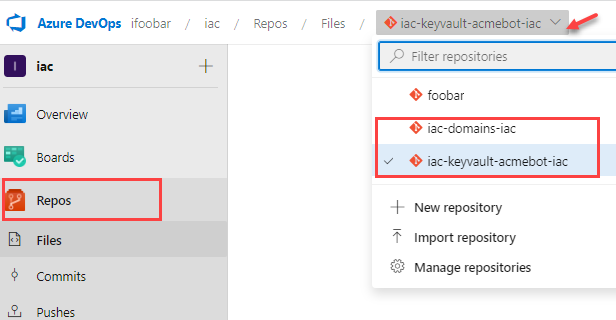
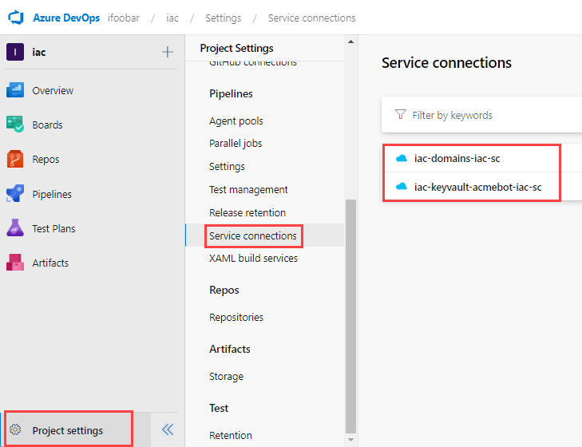
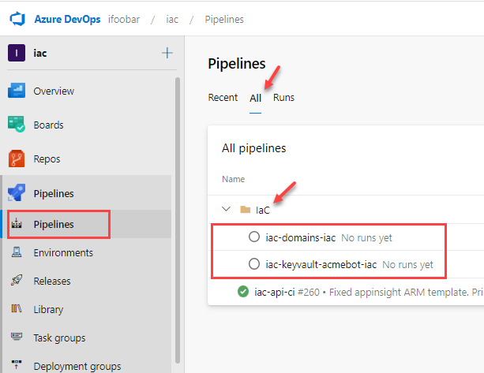
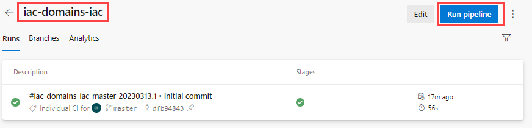
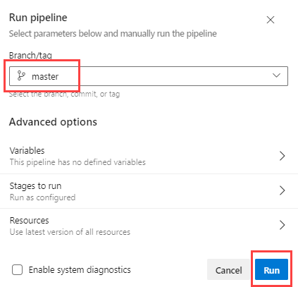
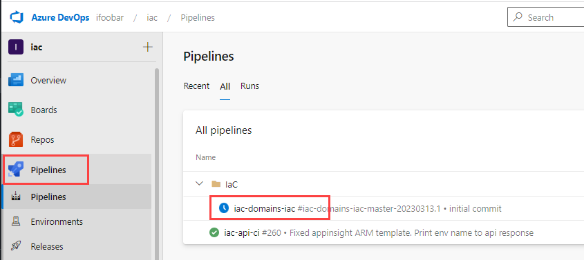
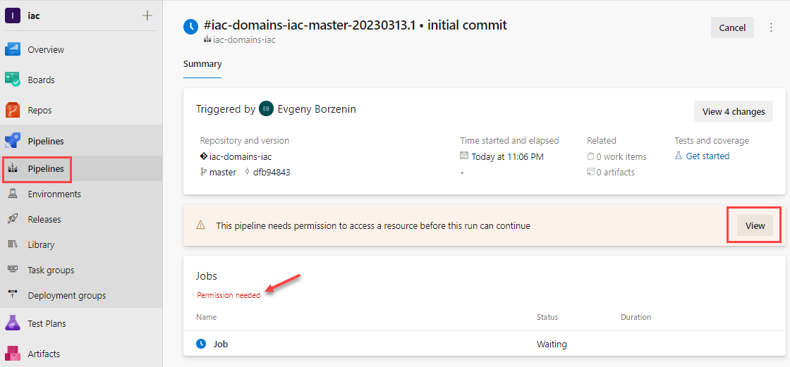
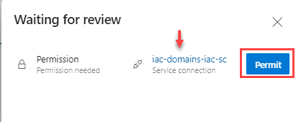
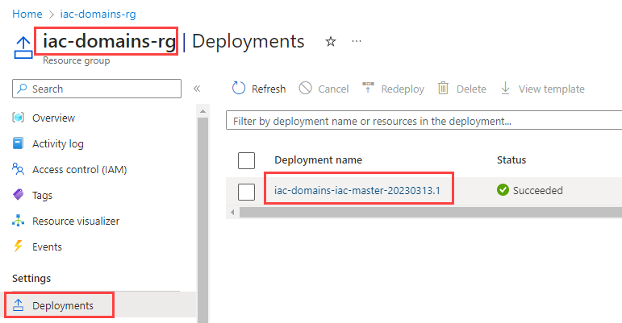

# lab-01 - provision workshop infrastructure

As always, we start by provisioning the infrastructure for the workshop. In this lab, we will provision the following resources:

* Resource Group
* Azure Service Principal for IaC deployment pipeline
* New Azure DevOps repository for IaC code
* New Azure DevOps Service Connection for deployment pipeline
* New Azure DevOps pipeline for IaC deployment
* New Azure Key Vault for certificate management

To learn more about how to automate Azure workload provisioning, check my [Automate Azure workload provisioning with Bicep, Powershell and Azure DevOps workshop](https://github.com/evgenyb/iac-workshops/tree/main/iac-with-azure-devops). We will use the final script from this workshop to setup automated pipeline for IaC provisioning.

## Task #1 - provision support resources for the workshop

We will be using `Create-Workload.ps1` script that we created during the [Automate Azure workload provisioning with Bicep, Powershell and Azure DevOps workshop](https://github.com/evgenyb/iac-workshops/tree/main/iac-with-azure-devops). It requires Azure Keyvault to store Azure Service Principal credentials. Let's provision Azure Keyvault first.
Since Azure Keyvault name has to be globally unique, we will use Bicep `uniqueString` function to generate a Key Vault name.

```powershell
# Navigate to the iac folder
cd iac

# Deploy lab infrastructure
./deploy.ps1
```

This script will create the following resources:

* A new resource group called `iac-ws3-rg`
* A new Azure Key Vault called `iac-ws3-<unique-string>-kv`
* A new Log Analytics Workspace `iac-ws3-<unique-string>-la`

In addition it will assign you a `Key Vault Administrator` role on the newly created Key Vault, so you can manage secrets.

## Task #2 - create two new workloads: domains and keyvault-acmebot

Before you can run `Create-Workload.ps1` script, you need to install [azure devops az cli extension](https://learn.microsoft.com/en-us/cli/azure/devops?view=azure-cli-latest) and then login to Azure DevOps with your Personal Access Token (a.k.a. PAT). You generate new personal access token at https://dev.azure.com/YOUR-ORGANIZATION/_usersSettings/tokens page. Make sure you select your organization or use `All accessible organizations` if you want to use this token within all organizations. To make things easier, during this workshop, use `Full access` as a token scope. At your production environment, you should go with `Custom defined` option and define scopes for each item: `Code`, `Release`, `Service Connections` etc.

```powershell
# Install Azure DevOps extension
az extension add --name azure-devops

# Login to Azure DevOps with your personal access token. You create new personal access token at https://dev.azure.com/YOUR-ORGANIZATION/_usersSettings/tokens
az devops login

# Test that you are logged in by querying your Azure DevOps projects
az devops project list --query value[].name -otsv
```

Then change the following variables inside `Create-Workload.ps1` script:

| Variable | Description |
| --- | --- |
| `$azureDevOpsOrganization` | Azure DevOps Organization url. For example, my organization url is https://dev.azure.com/ifoobar/  |
| `$spnMetadataKeyvaultName` | Azure Key Vault name. You can get Azure Key Vault name from the previous step with this command: `az keyvault list -g iac-ws3-rg --query "[].name" -o tsv` |

Save `Create-Workload.ps1` file and run it. Note that if your default branch is not `main`, you need to specify `-DevOpsRepositoryDefaultBranch` parameter. In my environment, the default branch is `master`, therefore I use `-DevOpsRepositoryDefaultBranch master`.

```powershell
# Navigate to the iac folder 
cd iac

# Create domains workload
./Create-Workload.ps1 -WorkloadName domains -CostCenter IaC -Owner 'James Bond' -DevOpsProject iac -Location norwayeast -DevOpsRepositoryDefaultBranch master

# Create keyvault-acmebot workload
./Create-Workload.ps1 -WorkloadName keyvault-acmebot -CostCenter IaC -Owner 'James Bond' -DevOpsProject iac -Location norwayeast -DevOpsRepositoryDefaultBranch master
```

At this point, you should have the following resources under your Azure DevOps project:

### Two new Azure DevOps repositories called `iac-domains-iac` and `iac-keyvault-acmebot-iac`



### Two new Azure DevOps Service Connections called `iac-domains-iac-sc` and `iac-keyvault-acmebot-iac-sc`



### Two new Azure DevOps pipelines under IaC folder called `iac-domains-iac` and `iac-keyvault-acmebot-iac`



At Azure side, you should have two new resource groups called `iac-domains-rg` and `iac-keyvault-acmebot-rg` and two new Service Principals (aka App Registrations) called `iac-domains-iac-spn` and `iac-keyvault-acmebot-iac-spn`. Let's check that they are there:

```powershell
# Get iac-domains-rg Resource Group
az group show -n iac-domains-rg

# Get iac-keyvault-acmebot-rg Resource Group
az group show -n iac-keyvault-acmebot-rg

# Get Service Principal ID for iac-domains-iac-spn
az ad sp list --filter "displayName eq 'iac-domains-iac-spn'" --query [0].id -otsv

# Get Service Principal ID for iac-keyvault-acmebot-iac-spn
az ad sp list --filter "displayName eq 'iac-keyvault-acmebot-iac-spn'" --query [0].id -otsv
```

## Task #3 - configure Azure DevOps pipeline for `domains` workload

Now, let's configure an empty and dummy infrastructure deployment pipeline for the `iac-domains-iac` repository. Later, we will use this pipeline to deploy Bicep code to the `iac-domains-rg` resource group.

Start by cloning the `iac-domains-iac` repository to your local machine.

```powershell
# Clone iac-domains-iac repository. You can find the URL and clone options from the Azure DevOps repository page.
git clone git@ssh.dev.azure.com:v3/<path-within-your-organization>/iac-domains-iac

# change directory to iac-domains-iac
cd iac-domains-iac

# Copy files from iac-repo-template folder into the root of the iac-domains-iac repository
cp -r <path-to>/iac-repo-template/* .
```

Edit `deploy.ps1` file and change `$workloadName` variable to `domains`.

```powershell
...
$workloadName = "domains"
...
```

Save the file and push the changes.

```powershell
# commit changes
git status
git add -A
git commit -m "initial commit"
git push
```

Now open `iac-domains-iac` pipeline and start it by clicking `Run pipeline` button.


Then select your branch and click `Run`.


If everything is configured correctly, you should see `iac-domains-iac` pipeline running in Azure DevOps.



Open the running instance of the pipeline and you will see that it needs you to permit this pipeline to use Service endpoint `iac-domains-iac-sc`.



click `View` and then `Permit` and then again `Permit`.



Pipeline will now start and should succeed. If so, go to the `iac-domains-rg` resource group and check `Deployments` blade. You should see a new deployment with the same name as the latest successful pipeline run.



## Task #4 - configure Azure DevOps pipelines for `keyvault-acmebot` workload

Repeat the same steps for the `iac-keyvault-acmebot-iac` repository. Remember that you need to change `$workloadName` variable to `keyvault-acmebot` in `deploy.ps1` file.

## Useful links

* [Azure DevOps](https://azure.microsoft.com/en-us/services/devops/)
* [Azure DevOps Repos](https://docs.microsoft.com/en-us/azure/devops/repos/get-started/what-is-repos?view=azure-devops)
* [Azure DevOps Pipelines](https://docs.microsoft.com/en-us/azure/devops/pipelines/get-started/pipelines-get-started?view=azure-devops)
* [Azure DevOps Service Connections](https://docs.microsoft.com/en-us/azure/devops/pipelines/library/service-endpoints?view=azure-devops&tabs=yaml)
* [az devops](https://docs.microsoft.com/en-us/cli/azure/ext/azure-devops/devops?view=azure-cli-latest)

## Next

[Go to lab-02](../lab-02/readme.md)