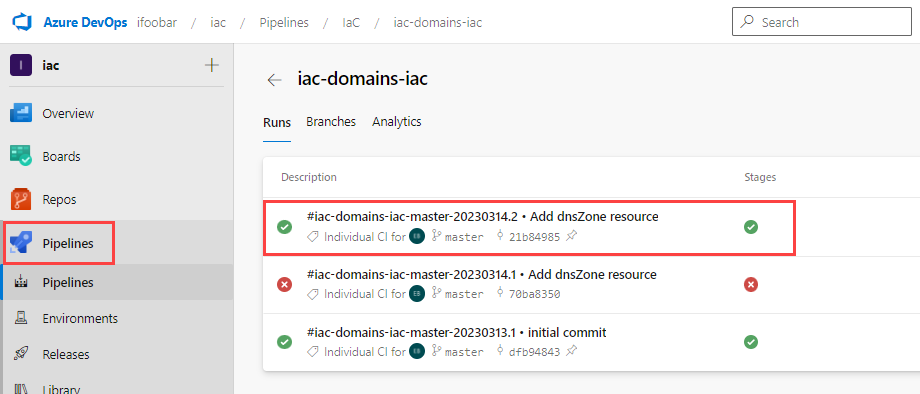
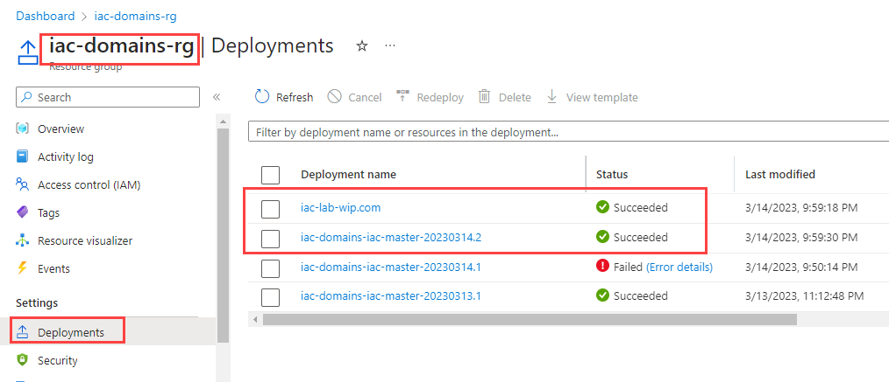
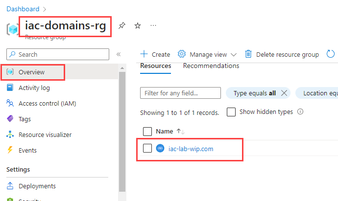
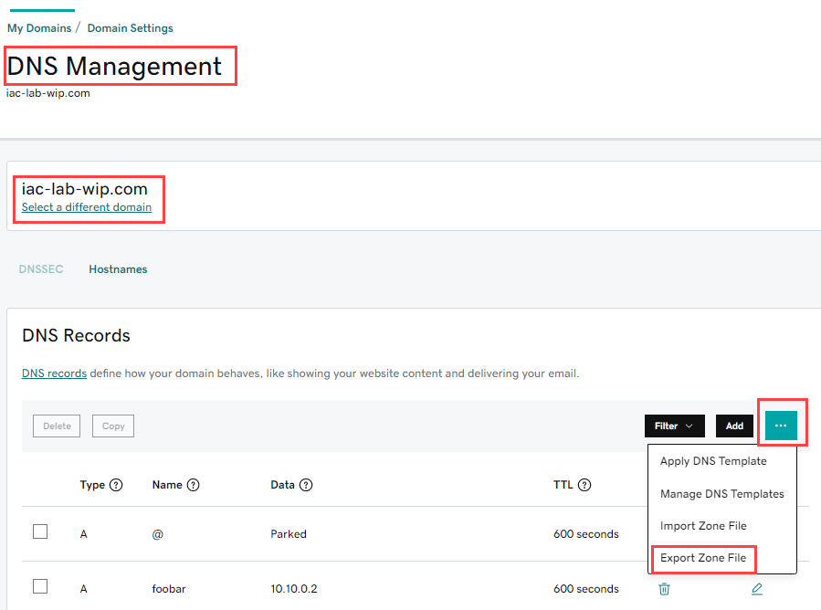
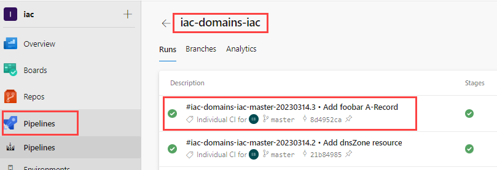
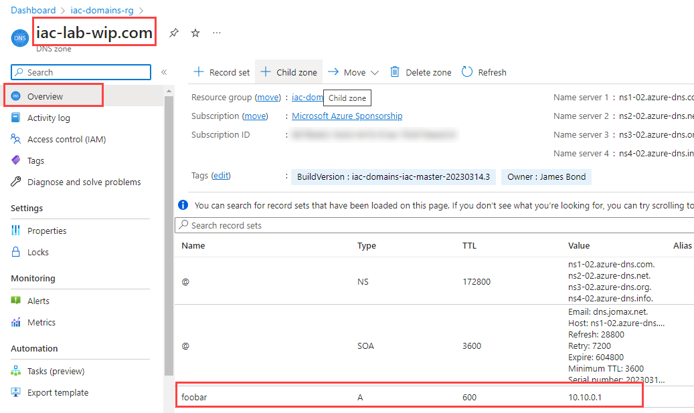

# lab-02 - create Azure DNS Zone

You can use `Azure DNS` to host your DNS domain and manage your DNS records. By hosting your domains in Azure, you can manage your DNS records as code.

Suppose you buy the domain `iac-lab-wip.com` from a domain name registrar (in my case, I purchased it from [GoDaddy](GoDaddy.com)). You then create an Azure DNS Zone with the same name `iac-lab-wip.com` and since you're the owner of the domain, you can configure the name server (NS) records for your domain. Users around the world are then directed to your domain in your Azure DNS zone when they try to resolve DNS records in `iac-lab-wip.com`.

In this lab you will:

* implement DNS zone resource for your domain using Bicep
* migrate DNS records from registrar to Azure DNS Zone
* add new DNS records to Azure DNS Zone as code

## Task #1 - implement DNS zone

Create new file called <YOU-DOMAIN-NAME>.bicep under `modules` folder of your `iac-domains-iac` repo with the following content:

```bicep
param tags object

resource dnsZone 'Microsoft.Network/dnsZones@2018-05-01' = {
  name: 'YOU-DOMAIN-NAME'
  location: 'global'
  tags: tags  
}
```

> Note, the name of dnsZone must be exactly the same as your domain name. In my case, it's `iac-lab-wip.com` and the Bicep file name is `iac-lab-wip.com.bicep`.

Edit `deployment.bicep` file with the following content:

```bicep
targetScope = 'resourceGroup'

param workloadName string
param location string
param buildVersion string

param tags object = {
  BuildVersion: buildVersion
  WorkloadName: workloadName
}

module dnsZone 'modules/YOU-DOMAIN-NAME.bicep' = {
  name: 'YOU-DOMAIN-NAME'
  params: {
    tags: tags
  }
}
```

Here we use `modules` feature of Bicep to import the DNS zone resource from the `modules\YOU-DOMAIN-NAME.bicep` file and we pass `tags` parameter to the module.

Commit changes to the `iac-domains-iac` repo.

```powershell
git status
git add -A
git commit -m "Add dnsZone resource"
git push
```

It will trigger the pipeline and deploy the changes to the `iac-domains-rg` environment. Check Azure DevOps `Pipelines`. You should have a new green release.



Check `Deployments` tab of the `iac-domains-rg` resource group and you should find new deployment with the same name as release name.



Check resources under `iac-domains-rg` resource group and you should find new DNS zone resource with the same name as your domain name.



## Task #2 - (optional) migrate DNS records from registrar to Azure DNS Zone

You should do this task only if you have DNS records in your domain registrar and you want them to be migrated.

### Export a zone file from registrar

At the registrar portal, go to `DNS Management` and export your DNS records to a file. I use GoDaddy. I navigated to `DNS Management` -> `iac-lab-wip.com` -> `DNS Records` and select `Export Zone file`.



In my case, records were exported into a file called `iac-lab-wip.com.txt`.

Check the content of this file and make sure that it contains only records you want to import. Change it if necessary.

### Import a zone file into Azure DNS Zone

You can't import records from the Azure portal. You need to use `az cli`. To import a zone file for your zone usee the following command:

```powershell
$domain = "YOU-DOMAIN-NAME"
$recordsFile = "path-to\exported-records-file.txt"
az network dns zone import -g iac-domains-rg -n $domain -f $recordsFile
```

## Task 3 - add new DNS records to Azure DNS Zone as code

Let's add new A-Record for `foobar` subdomain pointing to `10.10.0.1` IP address.

Open `iac-lab-wip.com.bicep` file and add the following resource:

```bicep
...
resource foobar 'Microsoft.Network/dnsZones/A@2018-05-01' = {
  name: 'foobar'
  parent: dnsZone
  properties: {
    TTL: 600
    ARecords: [
      {
        ipv4Address: '10.10.0.1'
      }
    ]
  }
}
```

Commit changes.

```powershell
git status
git add -A
git commit -m "Add foobar A-Record"
git push
```

This commit will trigger the pipeline and will deploy the changes to the your DNS Zone. Check Azure DevOps `Pipelines`. You should have a new green release.



Check you DNS Zone records at the portal. You should now have new A-Record for `foobar` subdomain.



## Useful links

* [Overview of DNS zones and records](https://docs.microsoft.com/en-us/azure/dns/dns-overview)
* [What is Azure DNS?](https://learn.microsoft.com/en-us/azure/dns/dns-overview)
* [az network dns zone](https://learn.microsoft.com/en-us/cli/azure/network/dns/zone?view=azure-cli-latest)

## Next

[Go to lab-03](../lab-03/readme.md)
