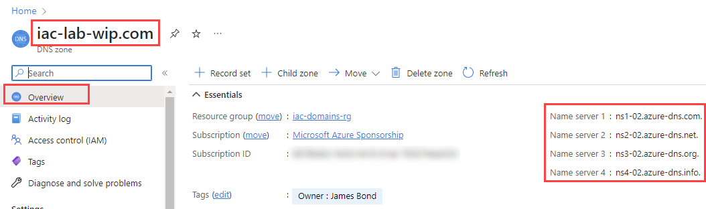

# lab-03 - delegate your domain to Azure DNS Zone

Azure DNS allows you to host a DNS zone and manage the DNS records for a domain in Azure. In order for DNS queries for a domain to reach Azure DNS, the domain has to be delegated to Azure DNS from the parent domain. Keep in mind Azure DNS isn't the domain registrar. 

At this lab you will learn:

* how domain delegation works
* how to delegate domains to Azure DNS

## Task #1 - retrieve name servers

In order to delegate your domain to Azure DNS, you need to retrieve the name servers for your Azure DNS zone. You can retrieve the name servers for your Azure DNS zone by using the Azure CLI:

```powershell
$domain = 'YOU-DOMAIN-NAME'
az network dns zone show -g iac-domains-rg -n $domain --query nameServers -o tsv
```

You can also get name servers from Azure portal. Navigate to `DNS Zones` and select your zone. In the `Overview` page, retrieve the name servers.



## Task #2 - delegate the domain

Once the DNS zone gets created and you have the name servers, you'll need to update the parent domain with the Azure DNS name servers. Each registrar has its own DNS management tools to change the name server records for a domain.

In the registrar's DNS management page, edit the NS records and replace the NS records with the Azure DNS name servers.

When you delegate a domain to Azure DNS, you must use the name servers that Azure DNS provides. Use all four name servers, regardless of the name of your domain.

I use GoDaddy as a domain registrar. In order to delegate the domain, I need to update the NS records in GoDaddy. If you used GoDaddy as well, navigate to `Manage DNS` for your domain, scroll down to the `Nameservers` section and click `Change`.


Then click `Enter my own nameservers (advanced)`


Then enter the name servers retrieved from Azure DNS zone and click `Save`. By default, GoDaddy gives you only two input boxes to enter the name servers. You can add more name servers by clicking `Add nameserver`.

> When you copy each name server address, make sure you copy the trailing period at the end of the address. The trailing period indicates the end of a fully qualified domain name. Some registrars, including GoDaddy, append the period if the NS name doesn't have it at the end.


Confirm the changes by selecting `Yes, I consent to update Nameservers for the selected domain(s).` and clicking `Continue`.


## Task #3 - verify the delegation

> You may need to wait at least 10 minutes after you complete the delegation, before you can successfully verify that it's working.

After you complete the delegation, you can verify that it's working by using `nslookup` to query the Start of Authority (SOA) record for your zone.

```powershell
$domain = 'YOU-DOMAIN-NAME'
nslookup -type=SOA $domain
```

you can also qery the nameservers for your domain:

```powershell
nslookup -type=NS $domain
```

When delegation is completed, it should return the four Azure name servers that you configured in the previous task.

If you completed previous lab and managed to add new `foobar` A-record, you can also query it:

```powershell
nslookup foobar.$domain
Non-authoritative answer:
Name:    foobar.iac-lab-wip.com
Address:  10.10.0.1
```

## Useful links

* [Delegation of DNS zones with Azure DNS](https://learn.microsoft.com/en-us/azure/dns/dns-domain-delegation)
* [Tutorial: Host your domain in Azure DNS](https://learn.microsoft.com/en-us/azure/dns/dns-delegate-domain-azure-dns)

## Next

[Go to lab-04](../lab-04/readme.md)
