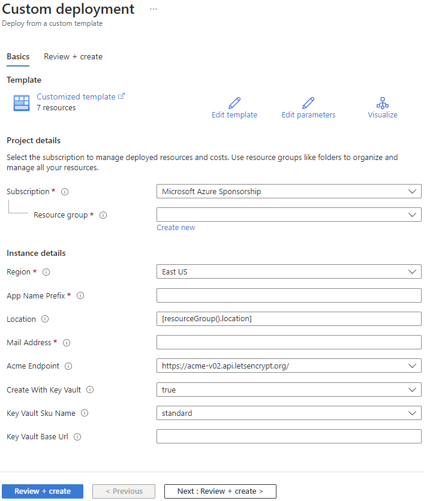
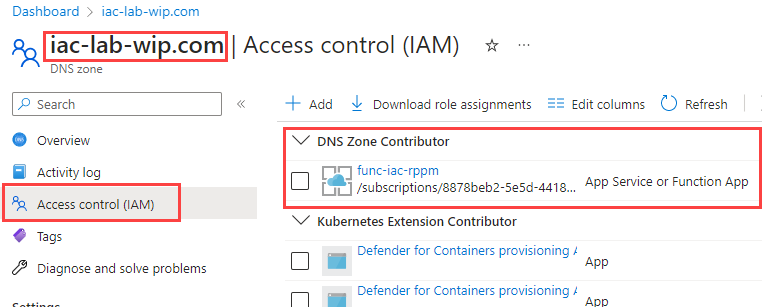
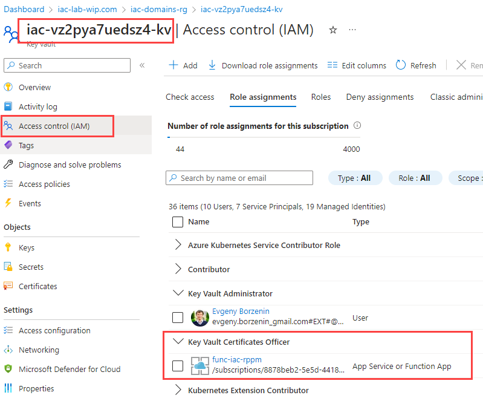
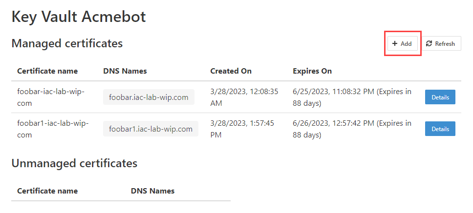
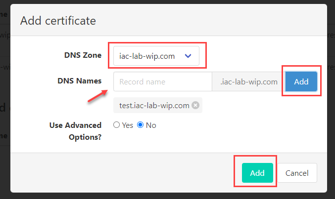
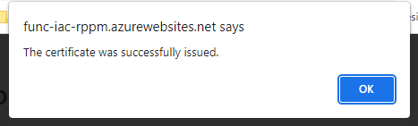
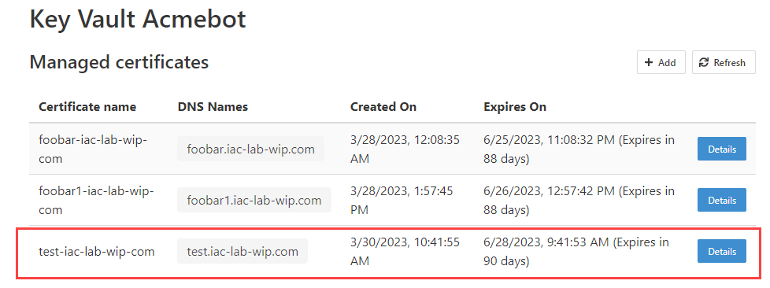
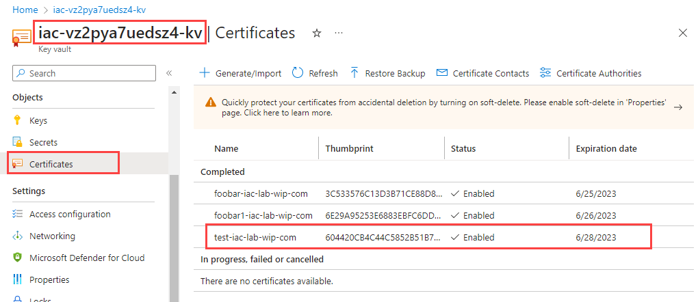

# lab-04 - deploy `keyvault-acmebot`

`keyvault-acmebot` is automated ACME SSL/TLS certificates issuer for Azure Key Vault (App Gateway / Front Door / CDN / others). Check the [motivation](https://github.com/shibayan/keyvault-acmebot#motivation) and [features support](https://github.com/shibayan/keyvault-acmebot#feature-support) from the original [documentation](https://github.com/shibayan/keyvault-acmebot).

It supports [several DNS providers](https://github.com/shibayan/keyvault-acmebot/wiki/DNS-Provider-Configuration#supported-dns-providers), including Azure DNS, Cloudflare, GoDaddy, Google Cloud DNS, Route53, etc., it can be easily extended to support custom DNS provider. It supports for ACME v2 compliant Certification Authorities (CA), including [Let's Encrypt](https://letsencrypt.org/), [Buypass](https://www.buypass.com/ssl/resources/acme-free-ssl) and [ZeroSSL](https://zerossl.com/features/acme/).

For this lab we will configure `keyvault-acmebot` to use Azure DNS with Let's Encrypt.

There are several ways you can deploy `keyvault-acmebot` to Azure (we will implement the last one):

## 1. Use Azure Portal (ARM Template)

The simplest one is to manually deploy it from the Azure portal. Follow the instruction from  [product main page](https://github.com/shibayan/keyvault-acmebot#deployment), click `Deploy to Azure (Public)` icon and specify the following deployment parameters:

    - `Subscription` - Azure subscription where you want to deploy `keyvault-acmebot`
    - `Resource Group` - Azure resource group where you want to deploy `keyvault-acmebot`
    - `Location` - the location for resources
    - `App Name Prefix` - the name of the function app that you wish to create, for example `iac`
    - `Mail Address` - email address for ACME account
    - `Acme Endpoint` - certification authority ACME Endpoint, in our case it's LetsEncrypt https://acme-v02.api.letsencrypt.org/
    - `Create With Key Vault` - if you choose true, create and configure a key vault at the same time
    - `Key Vault Sku Name` - specifies whether the key vault is a standard vault or a premium vault
    - `Key Vault Base Url` - the base URL of an existing Key Vault



It will then create all resources needed for the bot, including Azure KeyVault to store certificates, Storage Account to store state, Azure Log Analytics and Application Insights for monitoring. It will of course create Service plan and deploy Azure Function App and configure it to run the bot.

For some simple setup, that's enough, you can deploy it once, document deployment steps and off you go.

## 2. Use public Bicep Module

If you want to deploy it with IaC, you can use Bicep module from Private Registry (with public access). Check out the [documentation](https://github.com/shibayan/keyvault-acmebot/issues/427).

Here is one of possible implementations:

```bicep
...
module acmebot 'br:cracmebotprod.azurecr.io/bicep/modules/keyvault-acmebot:v3' = {
  name: 'acmebot'
  params: {
    appNamePrefix: 'iac'
    mailAddress: 'your@email-address.com'
    createWithKeyVault: true
    keyVaultSkuName: 'standard'
  }
}
...
```

With this setup, you can programmatically configure whether you want to create KeyVault as part of the deployment or use existing one. As with the first option, for most of the cases, this is good enough. And it's much better than the first option, because you can deploy it with IaC and automate it with CI/CD pipeline.

However, nether first nor second options allow you programmatically configure any of the [DNS Provider Configuration](https://github.com/shibayan/keyvault-acmebot/wiki/DNS-Provider-Configuration). You need to do it manually every time you redeploy `keyvault-acmebot`. Another "limitation" of the current version of IaC implementation is that you can't use existing Log Analytics. It will always create the new one.

## 3. Copy Bicep file and adjust it

If you want programmatically configure `DNS Provider Configuration` and specify wether you want to create a new Log Analytics or use existing one, then you need to implement it yourself. The downside of this approach is that you will then need to maintain it yourself. Every time `keyvault-acmebot` project updates their Bicep implementation or configuration "contract", you will need to update your copy as well. This is the price you pay for the flexibility and this is decision you need to make at your project.

If you go that route, there are several techniques how you can minimize the maintenance work. One approach could be to fork the original repository and implement your adjustments under your copy. Then you periodically sync your fork with the original repository and if there are any conflicts because of your custom implementation, you fix them as a regular merge conflicts exercise.

Another approach (and this is the best one in my opinion), if you see that there is some missing functionality that others might benefit from, you contribute into the repo by creating the PR with your implementation :)

For this lab, lets' implement the third option!

## Task #1 - implement `keyvault-acmebot` with Bicep

We will be working in `iac-keyvault-acmebot-iac` repository during this lab (we created one in [lab-01](../lab-01/readme.md)).

We will be using the [the original](https://github.com/shibayan/keyvault-acmebot/blob/master/azuredeploy.bicep) `keyvault-acmebot` Bicep file as a starting point and here are requirements for our implementation:

- we want configure if `keyvault-acmebot` should use existing Log Analytics workspace or create new one
- if use existing Log Analytics workspace, we want to specify the existing Log Analytics Workspace resource id
- we want to configure `DNS Provider Configuration` as an array of name, value objects

Feel free to implement it yourself. This is an excellent exercise mastering your Bicep skills :)

You can find my implementation [here](../../completed-labs/lab-04/src/modules/keyvault-acmebot.bicep) and here are the changes I made.

1. I introduced new parameters: `createWithLogAnalytics`, `logAnalyticsWorkspaceResourceId` and `dnsProviderConfiguration`

2. I added conditional deployment for Log Analytics `workspace` resource

```bicep
...
resource workspace 'Microsoft.OperationalInsights/workspaces@2022-10-01' = if (createWithLogAnalytics) {
...
```

3. The `WorkspaceResourceId` property of `appInsights` resource is now conditionally calculated based on the `createWithLogAnalytics` parameter.

```bicep
...
WorkspaceResourceId: (createWithLogAnalytics ? workspace.id : logAnalyticsWorkspaceResourceId)
...
```

4. Application settings are merged with `dnsProviderConfiguration` array.

```bicep
...
appSettings: concat(appSettings, dnsProviderConfiguration)
...
```  

Now, copy the content of the [completed labs](../../completed-labs/lab-04) folder into your `iac-keyvault-acmebot-iac` local repository.

Set the following parameters of the `parameters.json` file:

### keyVaultBaseUrl

Certificates Azure Keyvault URL. You can get it from the portal or with cli:

```powershell
# Get KeyVault URL
az keyvault list -g iac-domains-rg --query [0].properties.vaultUri -otsv
```

### logAnalyticsWorkspaceResourceId

Log Analytics Workspace resource id. You can get it from the portal or with cli:

```powershell
# Get Log Analytics Workspace resource id
az monitor log-analytics workspace list -g iac-ws3-rg  --query [0].id -otsv
```

### dnsProviderConfiguration

We use Azure DNS as a DNS provider, therefore we need to configure [DNS Provider Configuration for Azure DNS](https://github.com/shibayan/keyvault-acmebot/wiki/DNS-Provider-Configuration#app-settings-1). According to the documentation, we need to provide the subscription id where the DNS zone is located. Set your subscription id as a value of `Acmebot:AzureDns:SubscriptionId` key. You can get subscription id from the portal or with cli:

```powershell
# Get Subscription ID
az account show --query id -o tsv
```

### mailAddress

Set your email address.

Save changes and commit them into the repository. Make sure that you are in the root of the repository.

```powershell
# Make sure that you are at the right folder
pwd

# Check the status
git status

# Include all changes
git add -A

# Commit changes
git commit -m "Add custom implementation of keyvault-acmebot module"

# Push changes to the remote repository
git push
```

The `iac-keyvault-acmebot-iac` pipeline will start and should succeed. If it failed, go to the `iac-keyvault-acmebot-rg` resource group and check the latest deployment under `Deployments` blade.

## Task #2 - enable App Service Authentication

Follow the original [instructions](https://github.com/shibayan/keyvault-acmebot/wiki/Getting-Started#4-enable-app-service-authentication) and enable Azure Active Directory authentication for the `keyvault-acmebot` Azure Function.

## Task #3 - add access control (IAM) to Azure DNS zone and certificate Azure KeyVault

`keyvault-acmebot` is implemented as an Azure Function with [System Assigned Managed Identity](https://learn.microsoft.com/en-us/azure/active-directory/managed-identities-azure-resources/overview#managed-identity-types). To allow `keyvault-acmebot` to access Azure DNS zone and certificate Azure KeyVault, we need to add access control (IAM) to these resources:

- `keyvault-acmebot` need to maintain certificates, therefore we need to assign `keyvault-acmebot` managed identity with  `Key Vault Certificates Officer` role at the Azure KeyVault scope.  
- `keyvault-acmebot` meed to create DNS records, therefore we need to assign `keyvault-acmebot` managed identity with `DNS Zone Contributor` role at the Azure DNS zone scope

First, we need to get the `keyvault-acmebot` managed identity id. You can get it from the portal or with cli:

```powershell
# Get keyvault-acmebot Azure function system managed identity id
az functionapp list -g iac-keyvault-acmebot-rg  --query [0].identity.principalId -otsv
```

Open `parameters.json` file under `iac-domains-iac` repository and add guid you got at the previous command into `keyvaultCertificatesOfficers` and `dnsZoneContributors` arrays.

Commit your changes and push them to the remote repository.

```powershell
# get status
git status

# include all changes
git add -A

# commit changes
git commit -m "Add access control (IAM) to Azure DNS zone and certificate Azure KeyVault"

# push changes to the remote repository
git push
```

The `iac-domains-iac` pipeline will start and should succeed. If it failed, go to the `iac-domains-rg` resource group and check the latest deployment under `Deployments` blade.

Check that DNS zone and certificate Azure KeyVault have access control (IAM) assigned to the `keyvault-acmebot` managed identity.





## Task #4 - test `keyvault-acmebot`

Now it's time to test! Get `keyvault-acmebot` url.

```powershell
# Get keyvault-acmebot Azure function url
az functionapp list -g iac-keyvault-acmebot-rg  --query [0].defaultHostName -otsv
```

Add `/dashboard` to the end of the url and open it in the browser. You will be asked to sign in with your Azure Active Directory account. Sign in with your Azure Active Directory account. You will be redirected to the `keyvault-acmebot` dashboard and you should see the following dashboard:



Now let's issue a new certificate. Click `+ Add` button and fill in the form:

- select your domain from the `DNS Zone` drop-down list
- enter subdomain you want to issue certificate to and click `Add` (the blue one). It will add your domain under the `DNS Names` list
- click `Add` button (the Green one)



It might take up to a minute for the certificate to be issued. When it's done, you will see the following message



And you will see your certificate under the `Managed certificates` section



Now, navigate to your certificate Azure KeyVault at Azure portal and check that new certificate was created.



## Useful links

- [keyvault-acmebot](https://github.com/shibayan/keyvault-acmebot)
- [Get started with Key Vault certificates](https://learn.microsoft.com/en-us/azure/key-vault/certificates/certificate-scenarios)

## Next

[Go to lab-05](../lab-05/readme.md)
