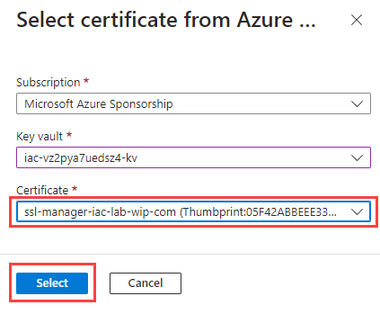

# lab-05 - Eating our own Dogfood - configure custom domain for `keyvault-acmebot`

Now, let's configure a custom domain for our `keyvault-acmebot` Azure function, so instead of https://YOUR-FUNCTIONS.azurewebsites.net/dashboard we use https://ssl-manager.YOUR-DOMAIN/dashboard.

During this lab, we will:

- create new CNAME record `ssl-manager` in Azure DNS Zone pointing to the `keyvault-acmebot` Azure function URL. We will implement the change with IaC and deploy it with CI/CD pipeline
- issue new certificate for new `ssl-manager` domain
- configure custom domain for `keyvault-acmebot` Azure function

## Task #1 - issue new certificate for new `ssl-manager` domain

Open `keyvault-acmebot` dashboard and issue new certificate for `ssl-manager` subdomain. 


Select your DNS Zone, add `ssl-manager` into the list of domains and click `Add` button (the green one). Wait for certificate to be issued and check that it's shown in the dashboard under `Managed certificates` section.


## Task #2 - create new custom domain for `keyvault-acmebot` Azure function

Open `keyvault-acmebot` Azure function and go to `Custom domains` blade. Click `Add custom domain` button, set `All other domain services` for `Domain providers` and `Add certificate later` for `TLS/SSL certificate`. Then enter `ssl-manager.YOUR-DOMAIN` under `Domain` field.

Once you enter the domain, you will get information for two domain records to validate your domain: `TXT` and `CNAME`. Keep this window open, we will use this information to create two new records in Azure DNS Zone.


> Now we will be working under `iac-domains-iac` repository. 

Open `modules\YOUR-DOMAIN.bicep` file under your `iac-domains-iac` repository and add two new  resources:

```bicep
...
resource sslmanager 'Microsoft.Network/dnsZones/CNAME@2018-05-01' = {
  name: 'ssl-manager'
  parent: dnsZone
  properties: {
    TTL: 600
    CNAMERecord: {
      cname: 'value-of-cname-record'
    }
  }
}

resource asuid_ssl_manager 'Microsoft.Network/dnsZones/TXT@2018-05-01' = {
  name: 'asuid.ssl-manager'
  parent: dnsZone
  properties: {
    TTL: 600
    TXTRecords: [
      {
        value: [
          'value-of-txt-record'
        ]
      }
    ]
  }
}
...
```

Save changes and commit them to the repository.

````powershell
# make sure that you are in the root of your iac-domains-iac repository
pwd

# get status
git status

# add changes to the repository
git add -A

# commit changes
git commit -m "add ssl-manager CNAME and TXT records"

# push changes to the remote repository
git push
````

The `iac-domains-iac` pipeline will start and should succeed. If it failed, go to the `iac-domains-rg` resource group and check the latest deployment under `Deployments` blade.
Check that new records are now added to the DNS Zone.


And you can test it with `nslookup` command:

```powershell
nslookup ssl-manager.YOUR-DOMAIN
nslookup -type=TXT asuid.ssl-manager.YOUR-DOMAIN
```

It should return the same values as you see under `Domain validation` section of `Add custom domain` form.

Now click to `Validate` button.


Both records should be validated and you should see the green OK status icons. Click `Add` and you will see the new custom domain added to the list. Next click `Add binding`, keep `TLS/SSL type` at `SNI SSL`, select `Import from Key Vault` under `Source` and click `Select key vault certificate` button.


Next, select subscription where your certificate Keyvault is located, select your certificate KeyVault and finally select `ssl-manager.YOUR-DOMAIN` certificate and click `Select`.



At next window, select `Validate` and if validation is successful, click `Add` button.


When import is finished, you should see the new custom domain added to the list.


## Task #3 - xxx

We need to add new domain into the Application Registration `Redirect URIs`. Open your `keyvault-acmebot` azure function, navigate to `Authentication` tab and click to the App Registration under Identity provider list. If you haven't change anything, then name of the App Registration is the same as the name of the Azure function.


At the App Registration page, click at `Redirect URIs` link.


Add new URI `https://ssl-manager.YOUR-DOMAIN/.auth/login/aad/callback` into the `Redirect URIs` list and click `Save`.


Now you can use your custom domain to access `keyvault-acmebot` dashboard.
Navigate to https://ssl-manager.YOUR-DOMAIN/dashboard.

## Next

[Go to lab-06](../lab-06/readme.md)
