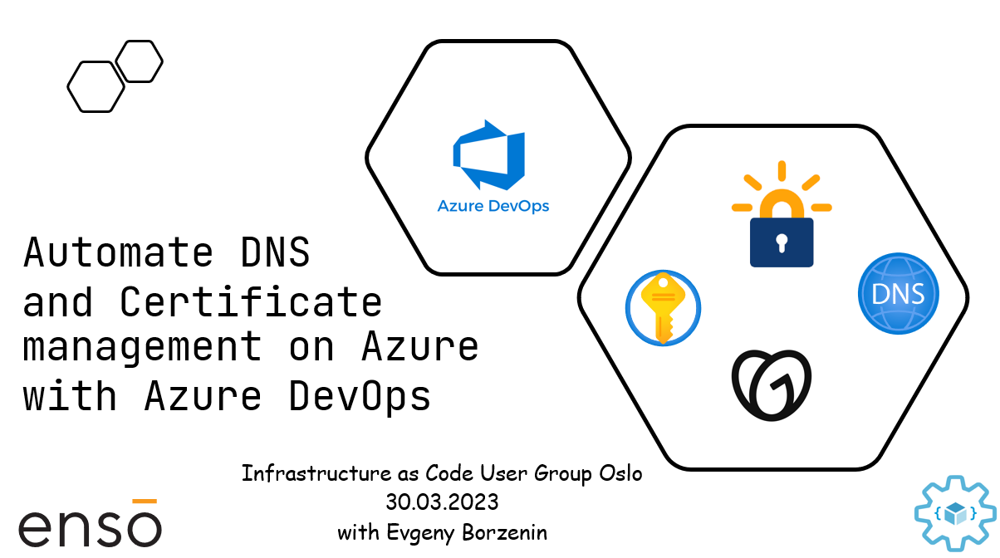

# Automate DNS and Certificate management on Azure with Azure DevOps

This is level 200 workshop that covers different aspects of automating DNS and certificate management on Azure with Azure DNS Zone, `keyvault-acmebot` and Azure DevOps and you will learn: 

* How to delegate domain to Azure DNS Zone
* How to automate DNS records management with Azure DevOps
* What options are available on Azure to maintain SSL certificates
* How to automate [Let's Encrypt](https://letsencrypt.org/) certificate management with `keyvault-acmebot`

## Agenda

* Welcome + practical information
* [Slides] - DNS and Certificate options on Azure
* [Lab-01](labs/lab-01/readme.md) - provision workshop infrastructure
* [Lab-02](labs/lab-02/readme.md) - create Azure DNS Zone
* [Lab-03](labs/lab-03/readme.md) - delegate your domain to Azure DNS Zone
* [Lab-04](labs/lab-04/readme.md) - deploy `keyvault-acmebot`
* Lab-05 - configure custom domain for keyvault-acmebot under your domain
* [Lab-06](labs/lab-06/readme.md) - cleaning up resources

## Links

* [Workshop prerequisites](prerequisites.md)
* [Let's Encrypt](https://letsencrypt.org/)
* [Key Vault Acmebot](https://github.com/shibayan/keyvault-acmebot)

## Feedback

* Visit the [Github Issue](https://github.com/evgenyb/iac-workshops/issues/7) to comment on this workshop.
