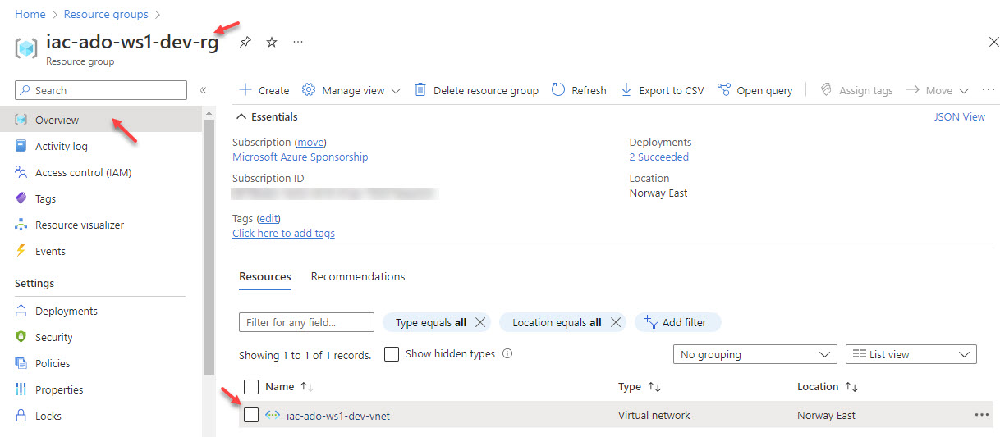
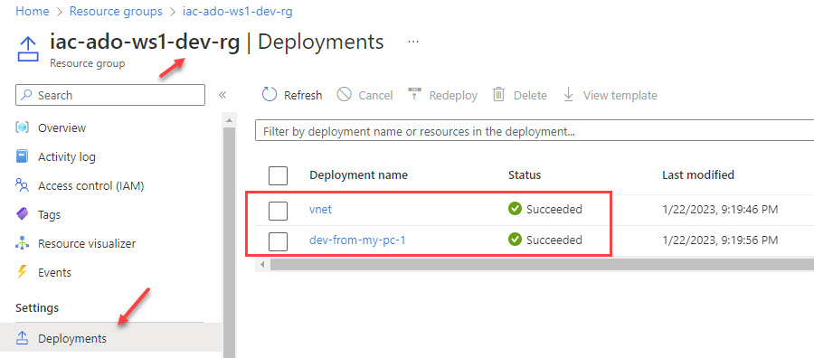
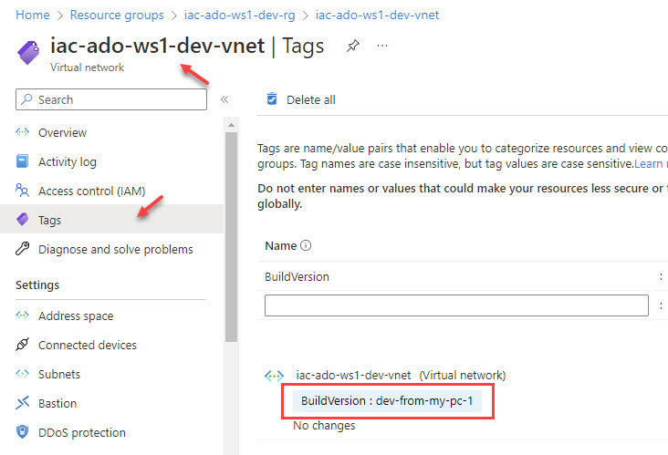

# lab-01 - provision workshop support resources, get familiar and deploy workshop workload resources

## Goals

We need some support resources for this workshop and we need to implement and deploy workload infrastructure. 
The goal of this lab:
* create support resources
* get familiar with workload infrastructure implementation and deploy it to `dev` environment.

## Conventions

We use the following [conventions](../../conventions.md) for this workshop.

## Task #1 - create support resources Resource group and deploy Azure Key Vault

```powershell
# Create resource group for support resources
az group create -n iac-ado-ws1-rg -l norwayeast

# create Azure Key Vault
az keyvault create -g iac-ado-ws1-rg -n iac-ado-ws1-<some random string>-kv
```

## Task #2 - check Workload infrastructure as code implementation

The workload that we will use during this workshop is very simple and contains one Azure Virtual Network resource with two subnets:

* `AzureBastionSubnet` for future Azure Bastion deployment
* `workload-snet` - subnet used to deploy workload related resources.

IaC code folders structure looks as follows:

```text
iac
   src
      modules
         vnet.bicep
      deployment.bicep
      parameters-dev.json
      parameters-test.json
      parameters-prod.json
   deploy.ps1        
```

### deploy.ps1 
`deploy.ps1` - scripts starts deployment of Bicep files using `az deployment group create` command. Script requires two input parameters:

* Environment - can be dev, test or prod
* DeploymentName - the name of the deployment

### modules folder

`modules` folder contains nodule called `vnet` which contains implementation of Azure Virtual Network resource.

### deployment.bicep

This is master deployment file that orchestrates deployment.

### parameters-(dev|test|prod).json

Json parameters files representing environments. It contains environment specific parameters, including:

* location
* vnetConfig - VNet configuration

Check the [Environments](../../environments.md) file for environment specific configuration.

## Task #3 - deploy workshop workload resources

We will manually deploy our workshop workload to `dev` environment

```powershell
# Make sure you are inside iac folder
pwd

# Create iac-ado-ws1-dev-rg resource group for dev environment
az group create -n iac-ado-ws1-dev-rg -l norwayeast

# Deploy to dev
.\deploy.ps1 -Environment dev -DeploymentName dev-from-my-pc-1
[Deployment: dev-from-my-pc-1] - deploying ado-ws1 workload to iac-ado-ws1-dev-rg resource group
...
```

Eventually, deployment will be done and you can check that resources were created. You can, for example, can do it at the Portal.



Check `Deployments`



As you can see, there is one `master` deployment called `dev-from-my-pc-1` and module deployment called `vnet`.

Check `Tags` section of `iac-ado-ws1-dev-vnet` resource.  



As you can see, now this resource is tagged with `Deployment` name.

## Useful links

* [az group create](https://learn.microsoft.com/en-us/cli/azure/group?view=azure-cli-latest#az-group-create)
* [az keyvault create](https://learn.microsoft.com/en-us/cli/azure/keyvault?view=azure-cli-latest#az-keyvault-create)

## Next
[Go to lab-02](../lab-02/readme.md)