# lab-02 - working with Azure Service Principal

## Goals

Automated tools that use Azure services should always have restricted permissions. Instead of having applications sign in as a fully privileged user, Azure offers `Service principals`.

In this lab you will learn:

* how to create new Service Principal in the Azure Portal
* how to create new Service Principal with `az cli`
* how to reset Service Principal credentials
* how to store Service Principal credentials to the Key Vault for further re-use
* how to manage Service Principal roles
* how to sign in using a Service Principal
* how to delete Service Principal

## Permissions required

You must have sufficient permissions to register an application with your Azure AD tenant, and assign to the application a role in your Azure subscription.
If your Azure AD tenant `App registrations` setting is set to `Yes`, any user in the Azure AD tenant can register an app.
If the `App registrations` setting is set to `No`, only users with elevated Azure AD roles may register these types of applications. Check [Azure AD built-in roles](https://learn.microsoft.com/en-us/azure/active-directory/roles/permissions-reference?WT.mc_id=AZ-MVP-5003837#all-roles) to learn about available administrator roles and the specific permissions in Azure AD that are given to each role. For example, user with `Application Developer` Azure AD role is able to register applications.

## Task #1 - use the portal to create an Azure AD application and service principal that can access resources

There is actually no way to directly create a `Service Principal` using the Azure portal. When you register an application through the Azure portal, an application object and `Service Principal` are automatically created in your tenant. 

### Register new application

To register new application, navigate to `Azure Active Directory`

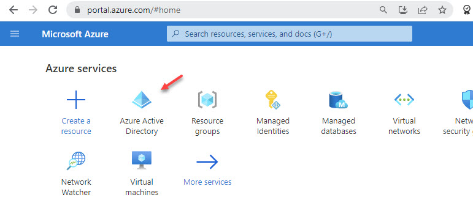

Select `App registrations` and click `New registration`

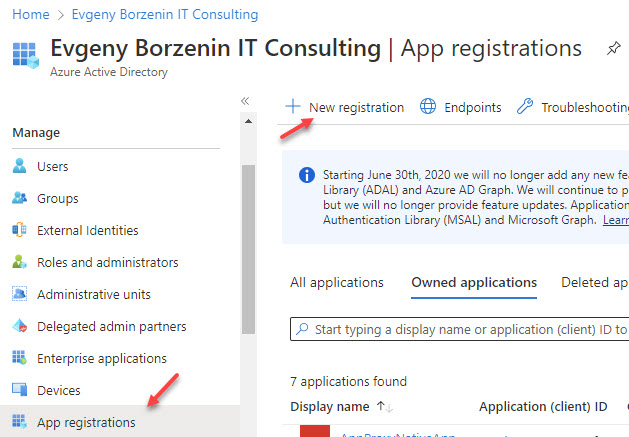

Name the application, for example "iac-spn". Set a supported account type to `Single tenant`. 
At this point, we can't create credentials for a Native application. After setting the values, select `Register`.

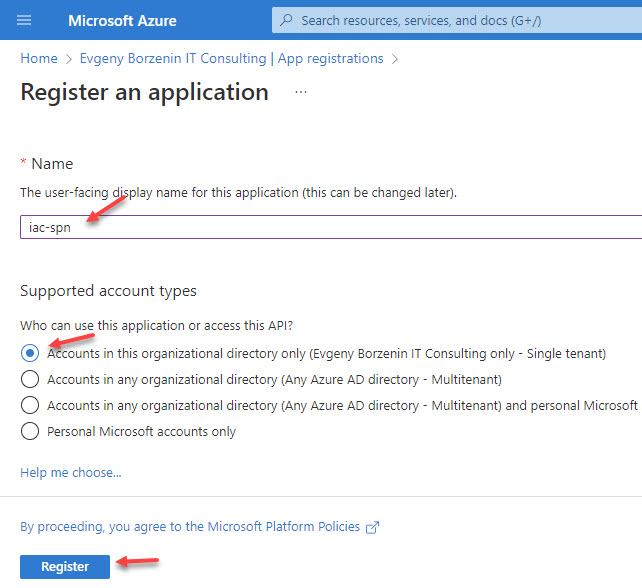

There are two types of authentication available for service principals: 
 * `password-based` authentication (aka application secret)
 * `certificate-based` authentication. 
 
We will use `password-based` authentication in our lab.

### Create a new application secret

Navigate to `Azure Active Directory -> App registrations` enter app name (`iac-spn`) into the search field and select your application. 

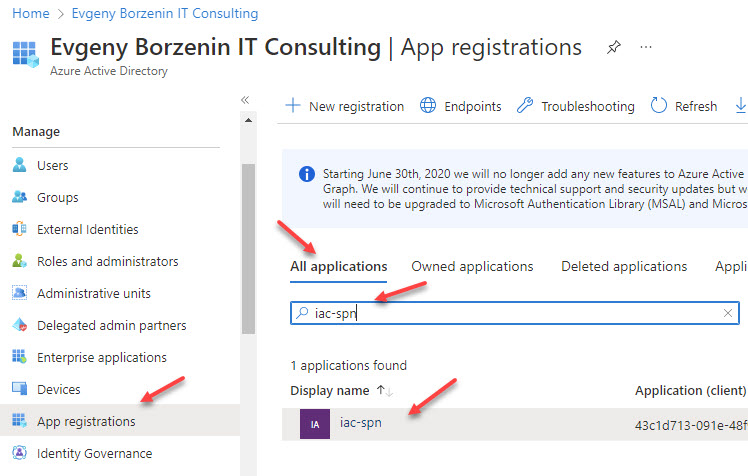

Select `Certificates & secrets`, open `Client secrets` tab and click `New client secret`

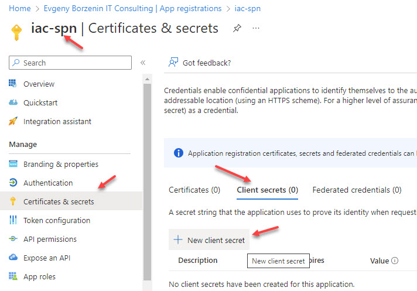

Provide a description of the secret, and a duration and click `Add`.

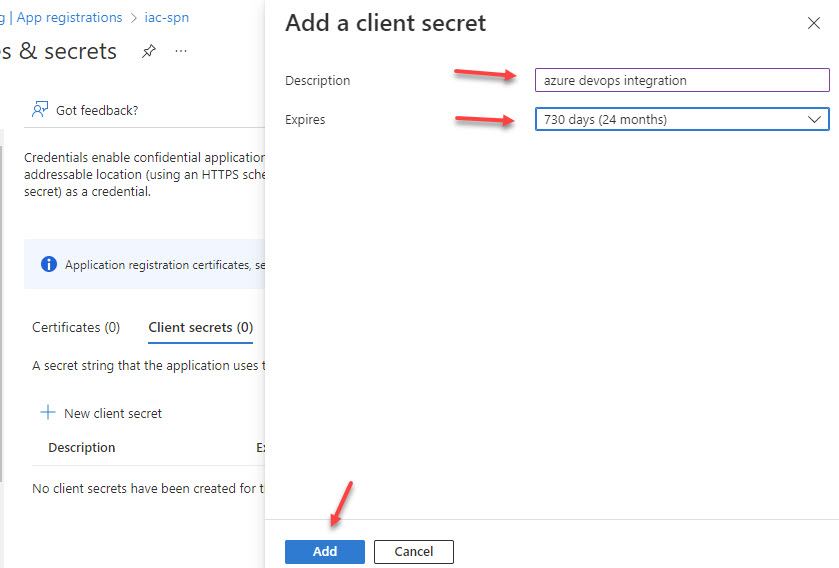

After saving the client secret, the value of the client secret is displayed. You should copy this value if you want  to use it further, because you won't be able to retrieve it later. You should store the secret where you or your application can retrieve it, for example at the Key Vault

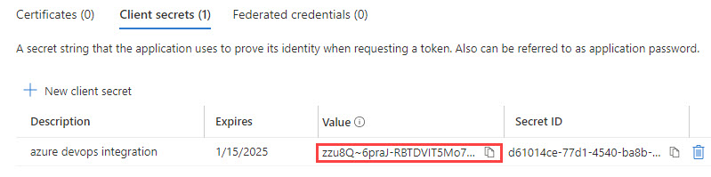

### Find Service Principal at the Portal

As we learned earlier, there are now two objects in Azure AD now:

* `Application object` (under `Application registration`) is used as a template to create service principal object 
* `Service principal object` type of `Application` (under `Enterprice applications`). This is local representation (or application instance), of a global `Application object`

Go back to `iac-spn` Application registration overview page and make note of `Application ID` and `Object ID` values.

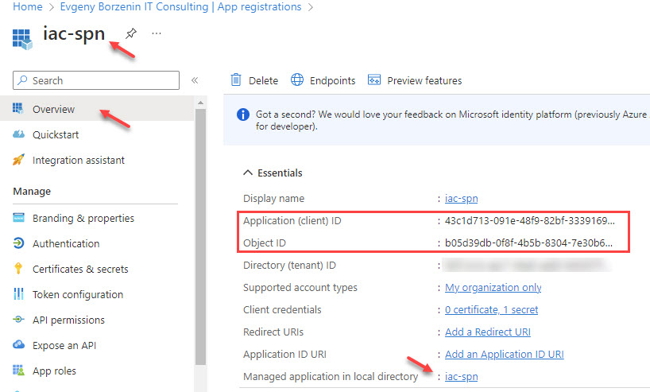

Then click at `Managed application in local directory` link. You will be redirected to the Service principal overview page and make note of `Application ID` and `Object ID` values. 

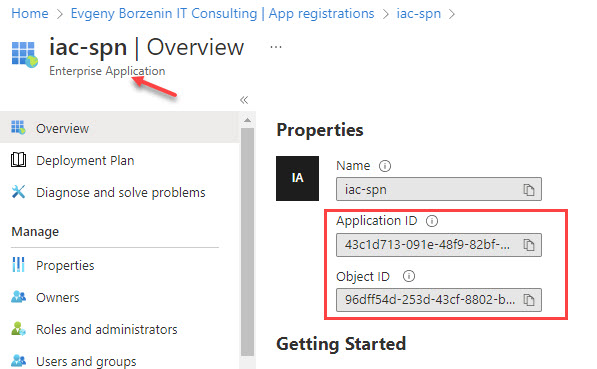

As you can see, the `Application ID` are the same, because both `Application object` and `Service Principal object` represent the same application, but `Object ID` are different, because these are two different objects in Azure AD.


## Task #2 - create an Azure service principal with the Azure CLI

Use [az ad sp create-for-rbac](https://learn.microsoft.com/en-us/cli/azure/ad/sp?WT.mc_id=AZ-MVP-5003837&view=azure-cli-latest#az-ad-sp-create-for-rbac) command to create an `Service principal`.

```powershell
# Create Azure Service principal
az ad sp create-for-rbac -n iac-lab1-task2-spn
{
  "appId": "00000000-0000-0000-0000-000000000000",
  "displayName": "iac-lab1-task2-spn",
  "password": "...",
  "tenant": "00000000-0000-0000-0000-000000000000"
}
```

When you create an `Service principal` using the `az ad sp create-for-rbac` command, the output includes credentials that you must protect. Be sure that you do not include these credentials in your code or check the credentials into your source control. 

### Find Service Principal at the Portal

Navigate to `Azure Active Directory -> Enterprise registrations` enter app name (`iac-lab1-task2-spn`) into the search field, set `Application type` filter to `All Application`.  You should see your `Service Principal`. 

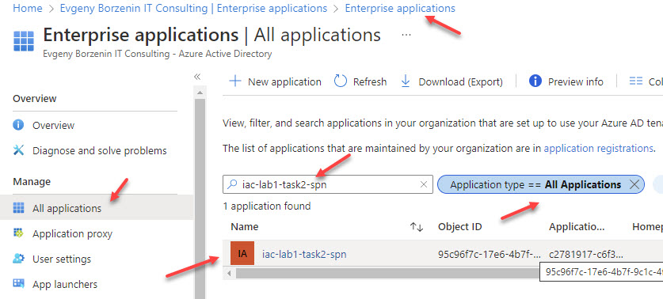


Or, you can find `iac-lab1-task2-spn` application under `Application registrations` and then select `Managed application in local directory` link from the Overview page.

### Find Service Principal with `az cli`

Quite often it's faster to get spn information using `az cli` 

```powershell
# Get Service Principal  by id
az ad sp show --id 95c96f7c-17e6-4b7f-9c1c-4f69f5b5e734
```

Normally, you don't know/remember SPN' id, so it's easier to get the ID by using Service Principal name. In this case, you can use `--filter` flag.

```powershell
# Get spn info by display name 
az ad sp list --filter "displayName eq 'iac-lab1-task2-spn'"

# Get spn id by spn name
az ad sp list --filter "displayName eq 'iac-lab1-task2-spn'" --query [0].id -otsv
```

## Task #3 - reset Service Principal password

Sometimes you need to reset the Service Principal password. In that case, use [az ad sp credential reset](https://learn.microsoft.com/en-us/cli/azure/ad/sp/credential??WT.mc_id=AZ-MVP-5003837&view=azure-cli-latest#az-ad-sp-credential-reset) command.

```powershell
# Get spn id by name
$spnId=(az ad sp list --filter "displayName eq 'iac-lab1-task2-spn'" --query [0].id -otsv)

# Reset spn credentials
az ad sp credential reset --id $spnId
{
  "appId": "00000000-0000-0000-0000-000000000000",
  "password": "...",
  "tenant": "00000000-0000-0000-0000-000000000000"
}
```

## Task #4 - store Service Principal credentials to the Azure Key Vault

A common use-case is when you need to store newly created or renewed Service principal credentials for further use into Azure KeyVault. As we already learned, when new SPN is created, its `appId`, `password` and `tenant` are return as an output in json format. We can then use `ConvertFrom-Json` powershell command to store it into PowerShell Json object.


```powershell
# Store $spnName name into $spnName variable
$spnName = 'iac-lab1-task4-spn'

# Create new Service Principal and store its output into $spnMetadata variable as a Json
$spnMetadata = (az ad sp create-for-rbac -n $spnName --only-show-errors -o json | ConvertFrom-Json)

# Show appId
$spnMetadata.appId

# Show password
$spnMetadata.password

# Show tenant id
$spnMetadata.tenant
```

Now, store `appID`, `password` and `tenant` into Azure Key Vault we created at `lab-01`.

```powershell
# Store KeyVault name into $spnMetadataKeyvaultName variable
$spnMetadataKeyvaultName = '<Azure Key Vault Name you used at lab-01>'

# Store SPN appId into $spnName-client-id secret
az keyvault secret set -n "$spnName-client-id" --value $spnMetadata.appId --vault-name $spnMetadataKeyvaultName -o none

# Store SPN password into $spnName-password secret
az keyvault secret set -n "$spnName-secret" --value $spnMetadata.password --vault-name $spnMetadataKeyvaultName -o none

# Store SPN tenant id into $spnName-tenant secret
az keyvault secret set -n "$spnName-tenant-id" --value $spnMetadata.tenant --vault-name $spnMetadataKeyvaultName -o none

# Show all secret 
az keyvault secret list --vault-name $spnMetadataKeyvaultName --query [].name
[
  "iac-lab1-task4-spn-client-id",
  "iac-lab1-task4-spn-secret",
  "iac-lab1-task4-spn-tenant-id"
]

# Get spn app id 
az keyvault secret show -n "$spnName-client-id" --vault-name $spnMetadataKeyvaultName --query value -otsv

# Get spn password from Key Vault
az keyvault secret show -n "$spnName-secret" --vault-name $spnMetadataKeyvaultName --query value -otsv

# Get spn tenant from Key Vault
az keyvault secret show -n "$spnName-tenant-id" --vault-name $spnMetadataKeyvaultName --query value -otsv
```

Note, you can use the same technique to store renewed credentials into Key Vault.

```powershell
$spnId=(az ad sp list --filter "displayName eq '$spnName'" --query [0].id -otsv)

# Reset credentials and store its output into $spnMetadata variable as Json
$spnMetadata = (az ad sp credential reset --id $spnId --only-show-errors -o json | ConvertFrom-Json)

# Store SPN appId into $spnName-client-id secret
az keyvault secret set -n "$spnName-client-id" --value $spnMetadata.appId --vault-name $spnMetadataKeyvaultName -o none

# Store SPN password into $spnName-password secret
az keyvault secret set -n "$spnName-secret" --value $spnMetadata.password --vault-name $spnMetadataKeyvaultName -o none

# Store SPN tenant id into $spnName-tenant secret
az keyvault secret set -n "$spnName-tenant-id" --value $spnMetadata.tenant --vault-name $spnMetadataKeyvaultName -o none

# Get spn app id 
az keyvault secret show -n "$spnName-client-id" --vault-name $spnMetadataKeyvaultName --query value -otsv

# Get spn password from Key Vault
az keyvault secret show -n "$spnName-secret" --vault-name $spnMetadataKeyvaultName --query value -otsv

# Get spn tenant from Key Vault
az keyvault secret show -n "$spnName-tenant-id" --vault-name $spnMetadataKeyvaultName --query value -otsv
```

## Task #5 - manage Service Principal roles

You can assign role when you create new Service Principal 

```powershell
# Get your active subscription id
$subscriptionID = (az account show --query id -otsv)

# Create new Service Principal and assign it with Reader role at the iac-devops-ws1-support-rg Resource group scope
az ad sp create-for-rbac -n iac-lab1-task5-spn --role Reader --scope /subscriptions/$subscriptionID/resourceGroups/iac-devops-ws1-support-rg

# Get iac-lab1-task5-spn appId
$spnId=(az ad sp list --filter "displayName eq 'iac-lab1-task5-spn'" --query [0].id -otsv)

# Get all iac-lab1-task5-spn roles
az role assignment list --assignee $spnId --all
```

To assign role for already existing Service Principal (`iac-lab1-task5-spn`) use the following command:

```powershell
# Assign Contributor role to iac-lab1-task5-spn Service Principal at iac-devops-ws1-support-rg Resource group scope
az role assignment create --assignee $spnId `
                          --role Contributor `
                          --scope /subscriptions/$subscriptionID/resourceGroups/iac-devops-ws1-support-rg

# Get all iac-lab1-task4-spn roles
az role assignment list --assignee $spnId --all
```

Last command should show two roles assigned to the `iac-lab1-task5-spn` Service Principal

To delete role assignment, use the following command.

```powershell
# Remove role assignment
az role assignment delete --assignee $spnId `
                          --role Contributor `
                          --scope /subscriptions/$subscriptionID/resourceGroups/iac-devops-ws1-support-rg

# Get all iac-lab1-task4-spn roles
az role assignment list --assignee $spnId --all
```


## Task #6 - sign in using a Service Principal

Sometimes you need to test or debug script execution under specific Service Principal and that requires you to sign in with Service Principal Credentials. We already stored 'iac-lab1-task4-spn' Service Principal credentials into the Key Vault, so we can use them with the following command:

```powershell
$spnName = 'iac-lab1-task4-spn'
$spnMetadataKeyvaultName = '<Azure Key Vault Name you used at lab-01>'

$appID = (az keyvault secret show -n "$spnName-client-id" --vault-name $spnMetadataKeyvaultName --query value -otsv)
$password = (az keyvault secret show -n "$spnName-secret" --vault-name $spnMetadataKeyvaultName --query value -otsv)
$tenantID = (az keyvault secret show -n "$spnName-tenant-id" --vault-name $spnMetadataKeyvaultName --query value -otsv)

# Sign in as iac-lab1-task4-spn
az login --service-principal --username $appID --password $password --tenant $tenantID
[
  {
    "cloudName": "AzureCloud",
    "homeTenantId": "...",
    "id": "...",
    "isDefault": true,
    "managedByTenants": [],
    "name": "Microsoft Azure Sponsorship",
    "state": "Enabled",
    "tenantId": "...",
    "user": {
      "name": "5d96ef62-2f1f-4ee2-97ec-947c2101b477",
      "type": "servicePrincipal"  # note that type is Service Principal
    }
  }
]

# Show current account
az account show

# Logout 
az logout

# Login as your user
az login

# Check that it's actually your account :)
az account show

```

## Task #7 - delete Service Principal

Now, let's cleanup and remove all Service principals we created at this lab.

```powershell
# Get iac-lab1-task2-spn Service Principal ip
$spnId=(az ad sp list --filter "displayName eq 'iac-lab1-task2-spn'" --query [0].id -otsv)

# Delete SPN
az ad sp delete --id $spnId

# Get app registration id  for iac-lab1-task2-spn app
$appId=(az ad app list --filter "displayName eq 'iac-lab1-task2-spn'" --query [0].id -otsv)

# Delete App Registration
az ad app delete --id $appId
```

Note, it might take several minutes to delete SPNs.

To delete `iac-spn` Service Principal, navigate to `Azure Active Directory -> Application registration`, find `iac-spn` app registration and delete it.

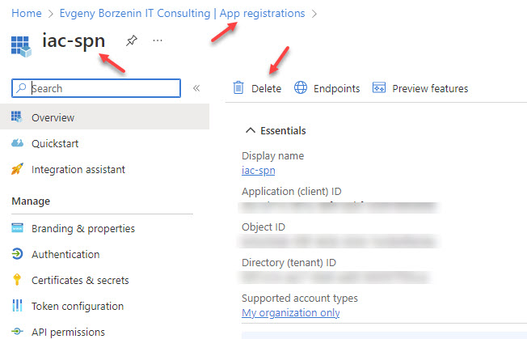


## Useful links

* [Manage service connections](https://learn.microsoft.com/en-us/azure/devops/pipelines/library/service-endpoints?WT.mc_id=AZ-MVP-5003837&view=azure-devops&tabs=yaml)
* [Common service connection types](https://learn.microsoft.com/en-us/azure/devops/pipelines/library/service-endpoints?WT.mc_id=AZ-MVP-5003837&view=azure-devops&tabs=yaml#common-service-connection-types)
* [Application and service principal objects in Azure Active Directory](https://learn.microsoft.com/en-us/azure/active-directory/develop/app-objects-and-service-principals?WT.mc_id=AZ-MVP-5003837)
* [Azure AD built-in roles](https://learn.microsoft.com/en-us/azure/active-directory/roles/permissions-reference?WT.mc_id=AZ-MVP-5003837#all-roles)
* [az keyvault secret commands](https://learn.microsoft.com/en-us/cli/azure/keyvault/secret?view=azure-cli-latest)
* [az ad sp create-for-rbac](https://learn.microsoft.com/en-us/cli/azure/ad/sp?view=azure-cli-latest#az-ad-sp-create-for-rbac)
* [az ad sp credential reset](https://learn.microsoft.com/en-us/cli/azure/ad/sp/credential?view=azure-cli-latest#az-ad-sp-credential-reset)
* [az ad sp delete](https://learn.microsoft.com/en-us/cli/azure/ad/sp?view=azure-cli-latest#az-ad-sp-delete)
* [az ad sp list](https://learn.microsoft.com/en-us/cli/azure/ad/sp?view=azure-cli-latest#az-ad-sp-list)
* [az role assignment create](https://learn.microsoft.com/en-us/cli/azure/role/assignment?view=azure-cli-latest#az-role-assignment-create)
* [az role assignment delete](https://learn.microsoft.com/en-us/cli/azure/role/assignment?view=azure-cli-latest#az-role-assignment-delete)
* [az role assignment list](https://learn.microsoft.com/en-us/cli/azure/role/assignment?view=azure-cli-latest#az-role-assignment-list)

[Go to lab-03](../lab-03/readme.md)