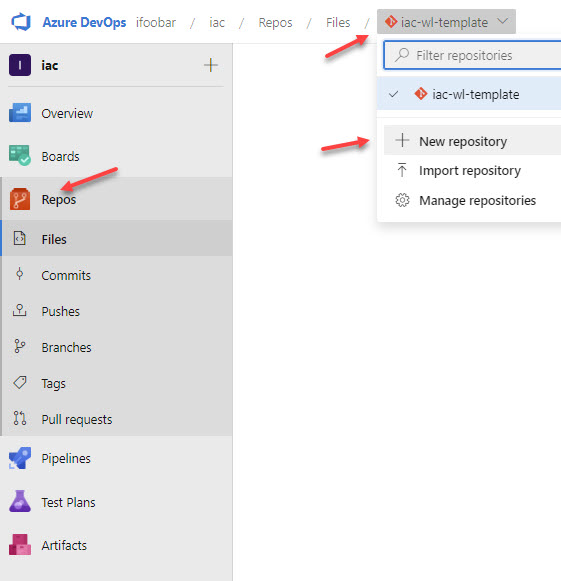
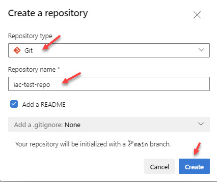
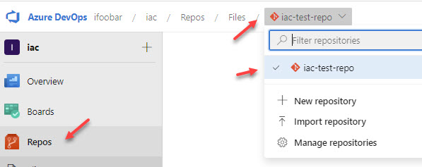
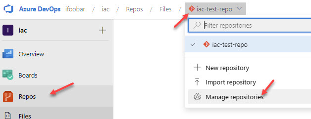
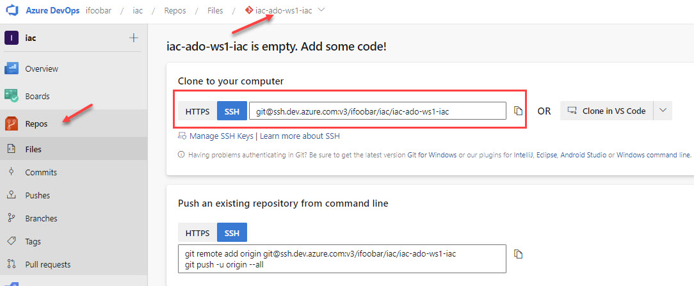
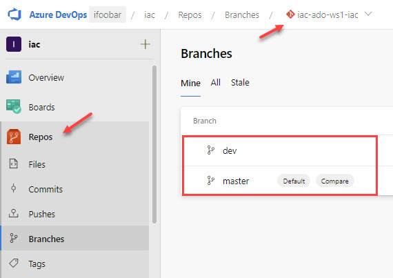

# lab-04 - working with Azure DevOps Repositories

Azure DevOps Repos is a set of version control tools that you can use to manage your code. Whether your software project is large or small, using version control as soon as possible is a good idea.

Azure Repos provides two types of version control:

* [git](https://learn.microsoft.com/en-us/azure/devops/repos/get-started/what-is-repos?view=azure-devops#git) - distributed version control
* [Team Foundation Version Control](https://learn.microsoft.com/en-us/azure/devops/repos/get-started/what-is-repos?view=azure-devops#tfvc) (TFVC): centralized version control

In this lab you will learn:

* how to create new Azure Git Repository from Azure Devops portal
* how to create new Azure Git Repository using `az devops` extension

## Task #1 - create a new Git repo in your project using Azure DevOps portal

Open the Repos page in your project by browsing to https://dev.azure.com/{your_organization_name} and navigate to `Repos` section. From the repo drop-down, select `New repository`.



In the `Create a new repository` dialog, select `Gis` is the repository type and enter a name for your repository, for example `iac-test-repo`, set `Add a README` if you want to add an empty README file. You can also select predefined `.gitignore` file, which tells Git what types of files to ignore. 



A new empty `iac-test-repo` Git repo is now created in your project. You can always find it from the repositories drop-down list



or from the `Manage repositories` page.



Here you can change repository settings, `Rename` or `Delete` it. 

## Task #2 - create a new Git repo in your project using `az devops`

`az devops` command group is a part of the azure-devops extension.

```powershell
# List Git repositories of a team project
az repos list -p iac

# List Git repositories names
az repos list -p iac --query [].name

# Show repo info and present it as PowerShell JSon object
az repos show --repository iac-test-repo --project iac -o json | ConvertFrom-Json

# Create Git Repo 
az repos create --name iac-ado-ws1-iac --project iac

# List Git repositories names
az repos list -p iac --query [].name
[
  "iac-test-repo",
  "iac-ado-ws1-iac"
]
```

## Task #3 - commit workload IaC code into repository

Now, let's move and store workload infrastructure code into `iac-ado-ws1-iac` repo. 
First, we need to clone it to your local repo. You can find repo clone URL either at the portal



or with `az repo` command

```powershell
# Get iac-ado-ws1-iac ssh url
(az repos show --repository iac-ado-ws1-iac --project iac -o json | ConvertFrom-Json).sshUrl

# Get iac-ado-ws1-iac HTTPS url
(az repos show --repository iac-ado-ws1-iac --project iac -o json | ConvertFrom-Json).remoteUrl
```

You can use `HTTPS` or `SSH` as a protocol. If you use `SSH`, then you need to generate and add SSH Public Key under your [User settings](https://dev.azure.com/ifoobar/_usersSettings/keys). Read more about it [here](https://learn.microsoft.com/en-us/azure/devops/repos/git/use-ssh-keys-to-authenticate?view=azure-devops).

Note, you need to clone this repository outside of `iac-workshops` folders structure. 

```powershell
# Make sure that you are outside of iac-workshops repo
pwd

# Clone iac-ado-ws1-iac repo (if you use SSH)
git clone git@ssh.dev.azure.com:v3/your_organization/your_project/iac-ado-ws1-iac
Cloning into 'iac-ado-ws1-iac'...
warning: You appear to have cloned an empty repository.

# Go into the folder
cd iac-ado-ws1-iac

# Make sure that you are at the correct folder
pwd
Path
----
C:\Users\evgen\git\iac-ado-ws1-iac
❯❯ iac-ado-ws1-iac git:(master) 

# Copy the content of `iac` folder into the iac-ado-ws1-iac repo
cp -r path_to_\iac-workshops\iac-with-azure-devops\iac\** path_to_\iac-ado-ws1-iac

# Check git status
git status

# Add all untracked files
git add -A

# Commit changes
git commit -m "Initial commit"

# Push changes
git push

# Create new dev branch
git checkout -b dev

# Push dev branch
git push --set-upstream origin dev
```

We have now two branches at the repo: `dev` and `master`




## Useful links

* [What is Azure DevOps Repos?](https://learn.microsoft.com/en-us/azure/devops/repos/get-started/what-is-repos?view=azure-devops)
* [Key concepts](https://learn.microsoft.com/en-us/azure/devops/repos/get-started/key-concepts-repos?source=recommendations&view=azure-devops)
* [Create a new Git repo in your project](https://learn.microsoft.com/en-us/azure/devops/repos/git/create-new-repo?view=azure-devops)
* [Use SSH key authentication](https://learn.microsoft.com/en-us/azure/devops/repos/git/use-ssh-keys-to-authenticate?view=azure-devops)
* [az repos commands group](https://learn.microsoft.com/en-us/cli/azure/repos?view=azure-cli-latest)
* [az repos create](https://learn.microsoft.com/en-us/cli/azure/repos?view=azure-cli-latest#az-repos-create)
* [az repos list](https://learn.microsoft.com/en-us/cli/azure/repos?view=azure-cli-latest#az-repos-list)
* [az repos show](https://learn.microsoft.com/en-us/cli/azure/repos?view=azure-cli-latest#az-repos-show)

## Next
[Go to lab-05](../lab-05/readme.md)