# lab-05 - working with Azure DevOps Pipelines

Azure DevOps Pipelines automatically builds and tests code projects. It supports all major languages and project types and combines continuous integration, continuous delivery, and continuous testing to build, test, and deliver your code to any destination.

Azure DevOps supports two type of pipelines:

* Classic - you create and configure pipelines in the Azure DevOps web portal with the Classic user interface editor. Normally, you define a `build pipeline` to build, test and publish your code artifacts. And you define a `release pipeline` to consume and deploy those artifacts to deployment targets.
* YAML based - you define your pipeline in a YAML file called `azure-pipelines.yml`. The pipeline file is versioned with your code. It follows the same branching structure, therefore you can implement different branch specific pipeline definition.

> We will only use YAML based pipelines during workshop!

In this lab you will learn:

* how to implement deployment pipeline to deploy Azure resources
* how to create new Azure DevOps pipeline form the portal
* how to create new Azure DevOps pipeline using `az pipelines`


## Task #1 - implement deployment pipeline to deploy Azure resources

A YAML based pipeline is defined using a YAML file in your repo. Usually, this file is called `azure-pipelines.yml` and it should be located at the root of your repository. 

A pipeline is one or more stages that describe a CI/CD process. Stages are the major divisions in a pipeline. The stages "Build this app," "Run these tests," and "Deploy to preproduction" are good examples. 

A stage is one or more jobs, which are units of work assignable to the same machine. You can arrange both stages and jobs into dependency graphs. Examples include "Run this stage before that one" and "This job depends on the output of that job."

A job is a linear series of steps. Steps can be tasks, scripts, or references to external templates.

In our case, we will use the simplest possible use-case. That is - single implicit job and stage. 

I already created file for our workload deployment. Open `azure-pipelines.yml` file located at the root of `iac-ado-ws1-iac` repo and let's walk through the content of this file:

```yaml
name: $(Build.DefinitionName)-$(Build.SourceBranchName)-$(Date:yyyyMMdd)$(Rev:.r)
trigger:
  branches:
    include:
      - dev
      - test
      - prod
  paths:
    exclude:
      - readme.md
      - .gitignore
      - azure-pipelines.yml

pool:  
  vmImage: 'ubuntu-20.04'

variables:
  serviceConnection: $(Build.DefinitionName)-$(Build.SourceBranchName)-sc
  environment: $(Build.SourceBranchName)

steps:
- task: AzureCLI@2
  displayName: 'Deploy workload infrastructure'
  inputs:
    azureSubscription: ${{ variables.serviceConnection }}
    scriptType: pscore
    scriptLocation: scriptPath
    scriptPath: ./deploy.ps1
    arguments: '-Environment ${{ variables.environment }} -DeploymentName $(Build.BuildNumber)'
```

* `name` -  defines pipeline run number (or release version). In our case we build it as a `pipelineName-branchName-YYYYMMDD.revision_within_the_day`
* `trigger.branches` - specifies which branch(es) cause a pipeline to run. We configured that changes at `dev`, `test` and `prod` branches will start the pipeline
* `trigger.paths` - specifies file paths to include or exclude for triggering a run. In our case we excluding `readme.md`, `.gitignore` and `azure-pipelines.yml` files
* `pool` - specifies which pool to use for a job of the pipeline
* `variables` - define variables to use in the pipeline. We use two variables: `environment` - which is the same as the branch and `serviceConnection` - which is a reference to the service connection associated with current environment (or branch)
* `steps` - are a linear sequence of operations that make up a job
* `steps:task` - runs a task. [Tasks](https://learn.microsoft.com/en-us/azure/devops/pipelines/tasks/reference/?view=azure-pipelines) are the building blocks of a pipeline. There's a catalog of tasks available to choose from. We use [AzureCLI@2task](https://learn.microsoft.com/en-us/azure/devops/pipelines/tasks/reference/azure-cli-v2?view=azure-pipelines) - Azure CLI v2 task which runs Azure CLI commands in a PowerShell Core/shell script. `scriptPath` tells that we run `deploy.ps1` script with `-Environment ${{ variables.environment }} -DeploymentName $(Build.BuildNumber)` parameters defined at `arguments` and that script should be running under the context of Service Principal associated with Azure DevOps Service Connection defined at `azureSubscription` parameter.

## Task #2 - create new YAML based pipeline from the Azure DevOps portal

Navigate to `Pipelines` section under your project and select `New pipeline`

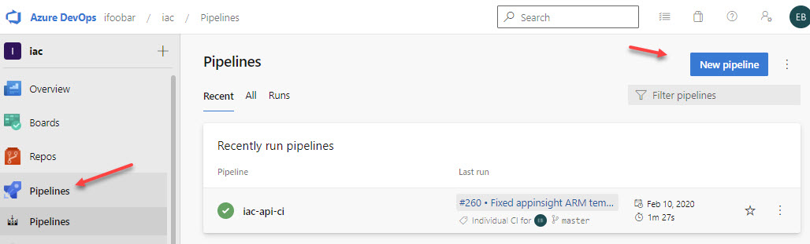

Select `Azure Repos Git` as a pipeline source code location

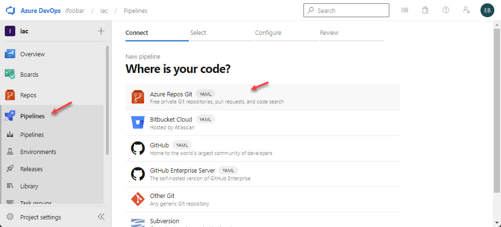

Select `iac-ado-ws1-iac` repository

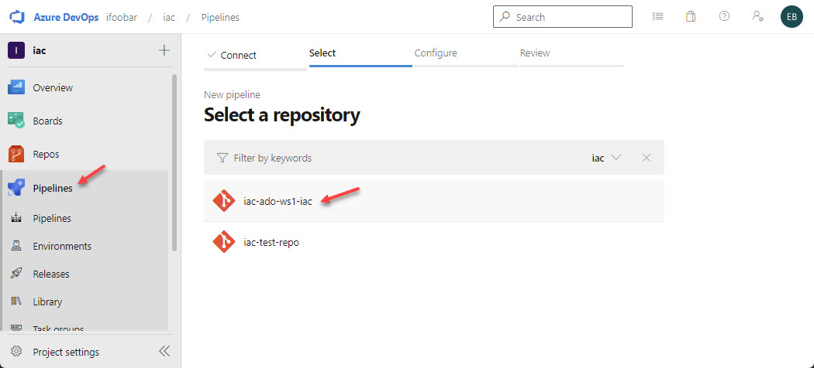

Azure DevOps will find `azure-pipelines.yml` file under the `dev` branch (this is the only branch we have now) and will show its content. It offers to `Run` the pipeline, but we don't do it just yet. We `Save` it for now.

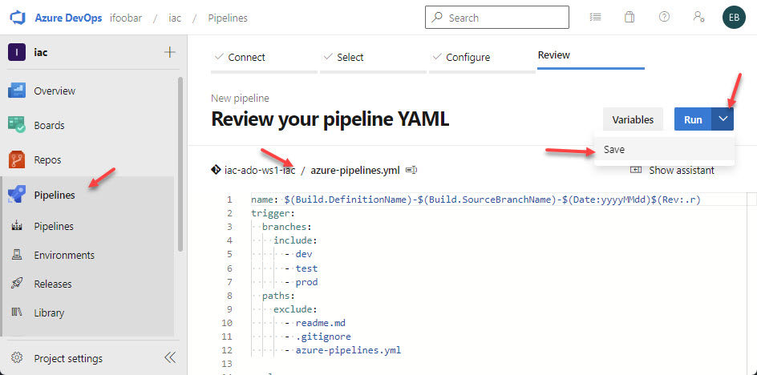

The new pipeline with the same name as repo - `iac-ado-ws1-iac` is now created. You can find it under `All` tab (it's not visible under `Resent` because it was never run yet)

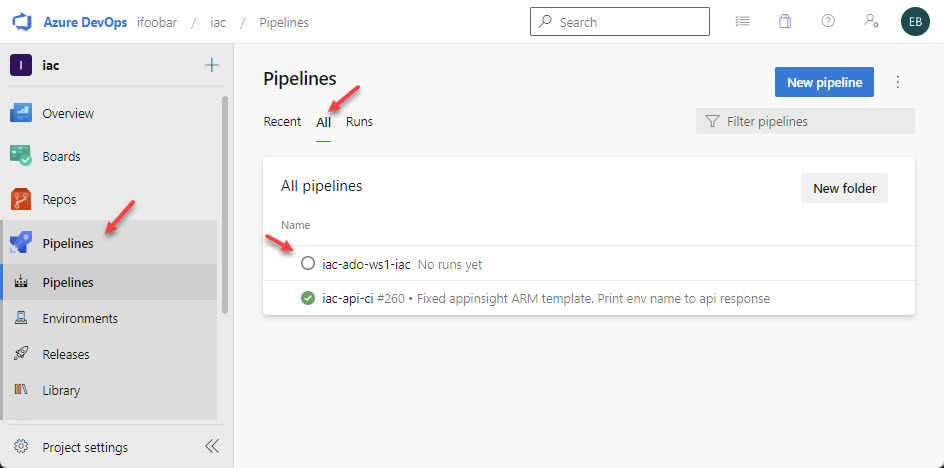

Now, let's delete this pipeline.

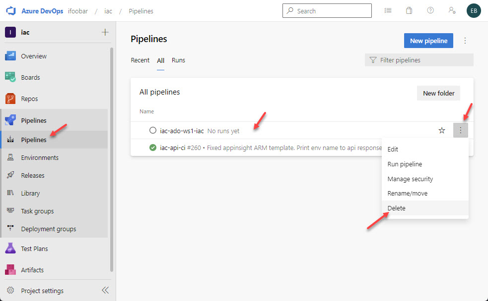

Confirm deletion by typing pipeline name and click `Delete`
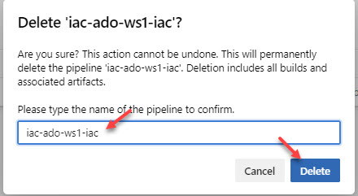

## Task #3 - create new YAML based pipeline using `az pipelines`
As with repos, `az pipelines` command group is a part of the azure-devops extension.

```powershell
$projectName = 'your_project_name'
# Create new pipeline
az pipelines create `
    --name iac-ado-ws1-iac `
    --description 'Pipeline for Workload IaC deployment' `
    --project $projectName `
    --repository iac-ado-ws1-iac `
    --branch dev `
    --repository-type tfsgit `
    --yaml-path azure-pipelines.yml `
    --skip-first-run true

# Get list of pipeline names 
az pipelines list -p $projectName -o json | ConvertFrom-Json
```

`az pipelines create` uses a lot of parameters. The important one for us are:

* project - the name of Azure DevOps project where our repo and pipelines are stored
* repository - the name of the repository where pipeline definition file (`azure-pipelines.yaml`) is stored 
* branch - the name of the branch 
* yaml-path - the path to the pipeline definition file (in case you store it not under root)
* skip-first-run - tels that create pipeline only and don't want to run it immediately 

## Task #4 - run pipeline

Now, let's run the pipeline. You can either do it from the pipeline list

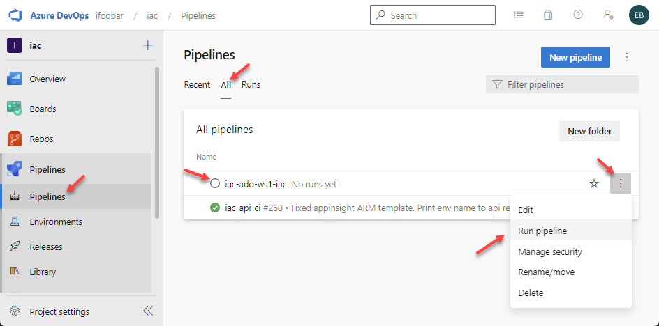

or from pipeline overview page 

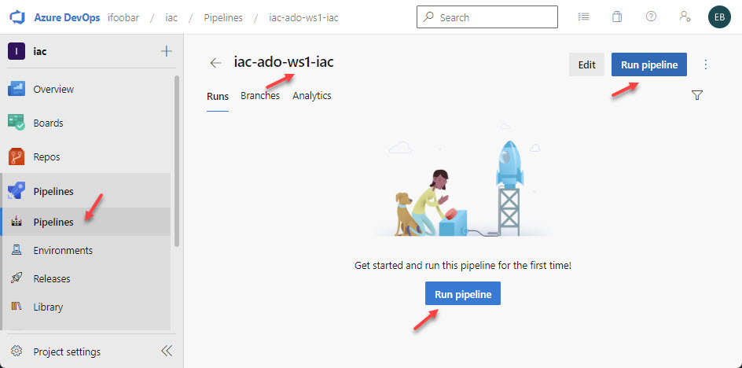

It offers you to select pipeline from which branch you want run. Again, since we only have `dev` branch, this is the only option we have now. Click `Run`

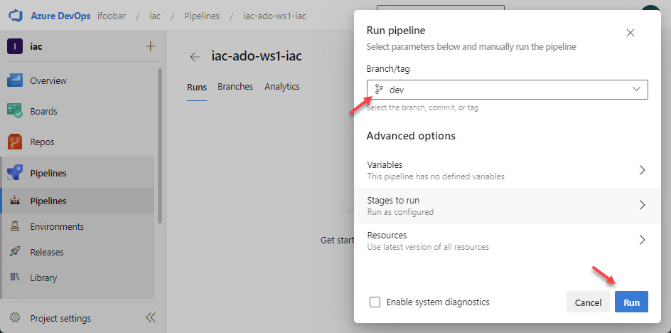

The new release will be created. Note the name of the release indicates that it was triggered from the `dev` branch, it contains release date in `yyyymmdd` format and shows release counter within the day.

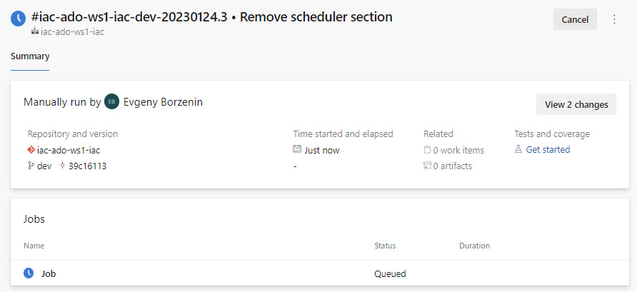

Refresh this page in browser (usability improvements for Azure DevOps team). As you can see, it shows that `This pipeline needs permission to access a resource before this run can continue`. This is because we run this pipeline for the first time and you (in production, normally it will be Azure DevOps engineer or admin) need to approve that this pipeline is allowed to use `iac-ado-ws1-dev-sc` service connection. Click `View`

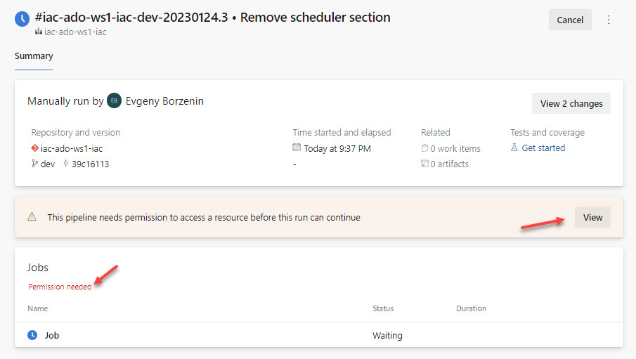

Click `Permit`

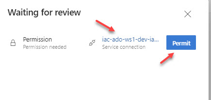


After a while, the pipeline will start the deployment and both release and `Job` icons will start indicate that the deployment is in progress.

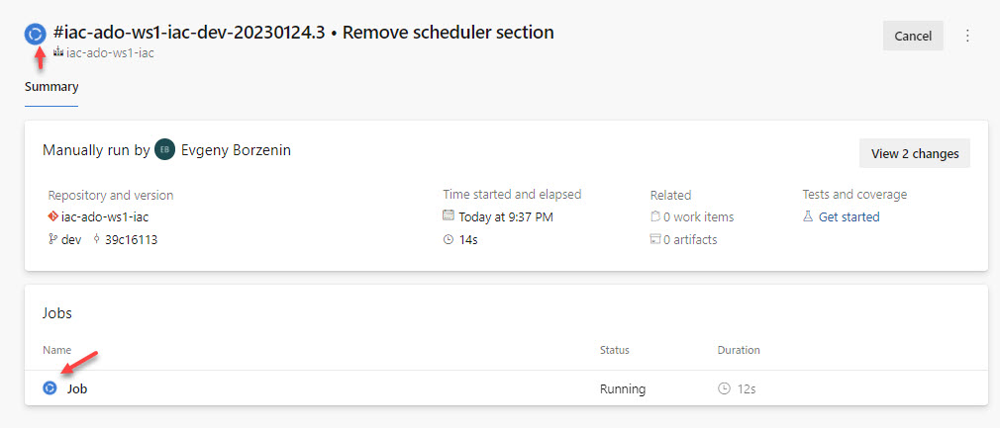

You can click to `Job` and observe what release does by looking into tasks logs. If there are any errors, they will be shown here as well.

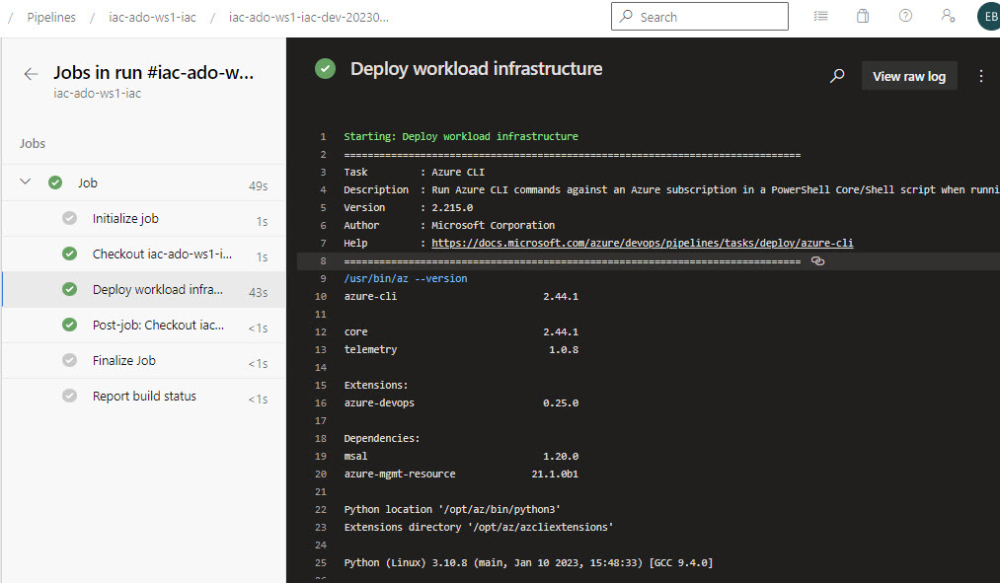

If everything works fine, you should get a green deployment. If you open `Deployments` for `iac-ado-ws1-dev-rg` resource group, you will find new deployment with the same name as the release name.

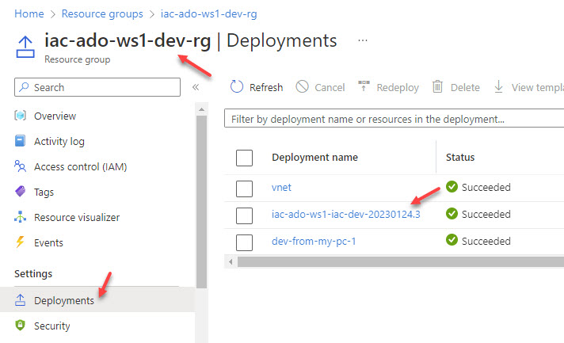

Note that Virtual Network `iac-ado-ws1-dev-vnet` is also tagged with `BuildVersion` tag containing release version.


## Useful links

* [What is Azure DevOps Pipelines?](https://learn.microsoft.com/en-us/azure/devops/pipelines/get-started/what-is-azure-pipelines?view=azure-devops)
* [Branch consideration for triggers in YAML pipelines](https://learn.microsoft.com/en-us/azure/devops/pipelines/build/triggers?view=azure-devops#branch-considerations)
* [Manage your pipeline with Azure CLI](https://learn.microsoft.com/en-us/azure/devops/pipelines/get-started/manage-pipelines-with-azure-cli?view=azure-devops)
* [YAML schema reference for Azure Pipelines](https://learn.microsoft.com/en-us/azure/devops/pipelines/yaml-schema/?view=azure-pipelines)
* [az pipelines](https://learn.microsoft.com/en-us/cli/azure/pipelines?view=azure-cli-latest)
* [az pipelines create](https://learn.microsoft.com/en-us/cli/azure/pipelines?view=azure-cli-latest#az-pipelines-create)
* [az pipelines list](https://learn.microsoft.com/en-us/cli/azure/pipelines?view=azure-cli-latest#az-pipelines-list)
* [AzureCLI@2 - Azure CLI v2 task](https://learn.microsoft.com/en-us/azure/devops/pipelines/tasks/reference/azure-cli-v2?view=azure-pipelines)

## Next
[Go to lab-06](../lab-06/readme.md)