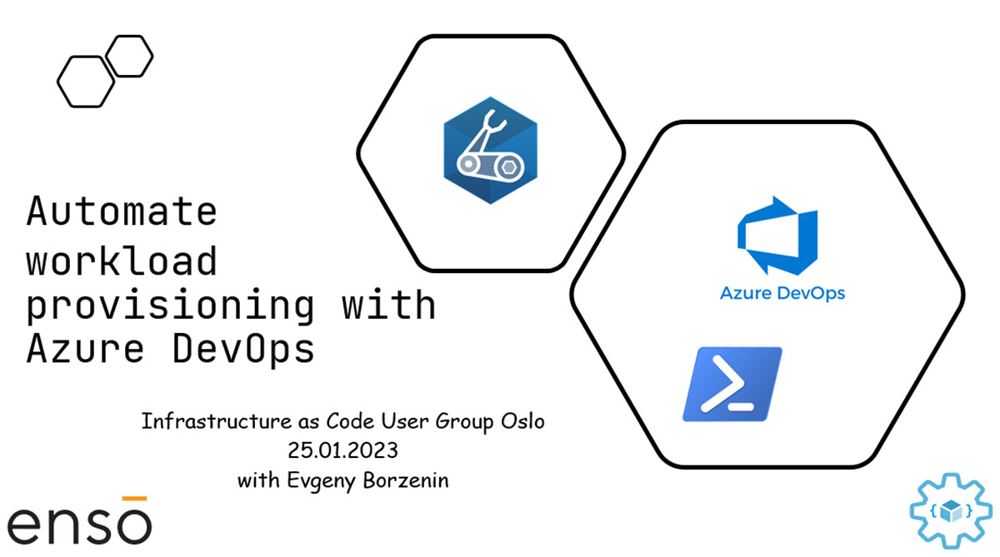

# Workshop - Automate Azure workload provisioning with Bicep, Powershell and Azure DevOps

This is an introduction level workshop that covers different aspects of automating infrastructure provisioning on Azure with DevOps and you will learn:

* What is Azure Service Principal, how to create it and how to properly scope it's RBAC permissions for your workload
* How to use `az devops` extension to automate Azure DevOps operations 
* How to create Azure DevOps Service Connection for workload Service Principal with `az devops` cli
* How to create IaC git Repository in Azure DevOps based on your Template repository
* How to create Azure DevOps IaC deployment pipeline using `az devops` cli
* What strategies are available to implement IaC for multi-environment workloads

## Agenda
 
[...WIP...]
 
## Links

* [Prerequisites](prerequisites.md)

## Feedback

* Visit the [Github Issue](https://github.com/evgenyb/iac-workshops/issues/1) to comment on this workshop. 
